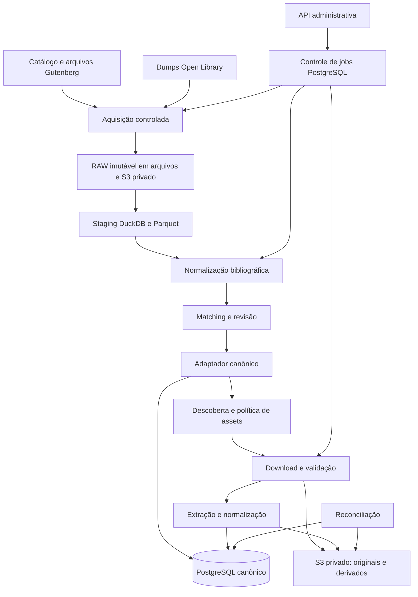

# Especificação de implementação — Microserviço de ingestão de livros

Versão: 1.0 · Data: 09/09/2026 · Nome sugerido: `book-ingestion-service`

## 1. Instrução ao Codex

Implemente um novo microserviço Java, Spring Boot e Maven para ingestão, população e atualização da base de livros de uma plataforma de recomendação, analytics e distribuição. Este documento é a especificação executável da tarefa: entregue código funcional, migrations aplicáveis, testes, infraestrutura local e documentação. Não entregue apenas um plano, interfaces sem implementação ou respostas simuladas em código de produção.

O serviço deverá adquirir metadados e arquivos de fontes autorizadas, preservar os originais, preparar dados em staging, resolver identidades, enriquecer o catálogo PostgreSQL e registrar assets versionados em object storage S3-compatible, inicialmente SeaweedFS. O resultado deve preparar etapas futuras de analytics sem implementá-las nesta tarefa.

Antes de alterar o repositório:

1. Leia `AGENTS.md`, documentação, módulos Maven, contratos de storage, schema canônico, migrations e padrões de autenticação existentes.
2. Identifique o proprietário das tabelas canônicas e dos metadados operacionais de ingestão. Registre o mapeamento entre os conceitos deste documento e as tabelas reais.
3. Reutilize convenções e componentes existentes. Não renomeie tabelas ou recrie um catálogo paralelo porque os nomes diferem dos exemplos.
4. Se o repositório estiver vazio, implemente a estrutura mínima autocontida descrita aqui, inclusive o modelo canônico necessário ao fluxo completo.
5. Não altere arquivos de referência marcados como somente leitura. Não execute importações volumosas automaticamente durante build, testes, startup ou migrations.
6. Resolva escolhas rotineiras e documente-as em ADRs. Uma incompatibilidade real com contratos existentes deve ser explicitada; não alegue integração concluída usando um adaptador fictício.

Os termos **DEVE**, **NÃO DEVE** e **OBRIGATÓRIO** são requisitos de aceitação. Exemplos de nomes podem ser adaptados ao repositório, preservando comportamento e integridade.

## 2. Objetivo, escopo e fronteiras

### 2.1 Entrega obrigatória

- Importação do catálogo machine-readable do Project Gutenberg, filtros e persistência rastreável de registros selecionados.
- Download ou uso de snapshots locais dos dumps de autores, obras e edições da Open Library; preparação local com arquivos e DuckDB.
- População inicial orientada pelo Gutenberg; Open Library utilizada para matching e enriquecimento, importando no PostgreSQL apenas registros relevantes e suas dependências.
- Distinção entre obra, edição digital, autores/contribuidores, registro de fonte, asset lógico, versão física e direitos de distribuição.
- Jobs persistentes, execução assíncrona, retomada, cancelamento cooperativo, reprocessamento e reconciliação.
- Download de EPUB, HTML e TXT, validação, armazenamento original imutável, extração de texto normalizado e estrutura de capítulos.
- Proveniência de campos, decisões de matching auditáveis e revisão administrativa.
- APIs administrativas protegidas, configuração validada, observabilidade, testes e Docker Compose reproduzível.

### 2.2 Fora do escopo desta implementação

Feed, recomendações, embeddings, LLMs, ranking de trechos, OCR, conversão de PDF, audiobooks, reader, CDN, cobrança, busca pública e aquisição de livros restritos. Internet Archive é uma extensão futura, não um downloader a implementar. Não acessar empréstimos, DRM ou arquivos restritos identificados na Open Library.

Geração de um novo EPUB, capas e thumbnails é extensão opcional explícita; o núcleo obrigatório entrega o EPUB original quando disponível, `normalized.txt` e `chapters.json`. Não chamar uma cópia inalterada de EPUB normalizado. A conclusão do núcleo não depende dessas extensões.

### 2.3 População inicial e expansão

O padrão é `DISTRIBUTABLE_FIRST`: importar metadados Gutenberg selecionados, avaliar direitos, enriquecer e processar arquivos elegíveis. O nome expressa prioridade, não garantia jurídica. Um registro pode existir no catálogo sem download ou permissão de distribuição.

Não importar todas as edições Open Library para PostgreSQL por padrão. Um futuro modo `CATALOG_FULL` deve ser documentado como não implementado se não houver uma implementação real com limites e testes. Não expor opções inoperantes.

## 3. Decisões arquiteturais de referência

| Tema | Decisão padrão |
|---|---|
| Runtime | Java 21 LTS como baseline de projeto novo; Spring Boot compatível e suportado, versões fixadas após verificação oficial |
| Build | Maven Wrapper, BOM do Spring Boot, dependências e imagens sem `latest` |
| Batch | Spring Batch com JobRepository persistente PostgreSQL |
| Controle operacional | PostgreSQL; não usar DuckDB como fila ou coordenador distribuído |
| Staging | Downloads em streaming, arquivos imutáveis, Parquet particionado e DuckDB via JDBC |
| Escrita canônica | Adaptador JDBC transacional por padrão, respeitando ownership existente |
| Binários | AWS SDK for Java v2, interface S3; nenhuma API proprietária no domínio |
| Migrations | Ferramenta já adotada; Flyway se o projeto for novo |
| Segurança | Spring Security Resource Server/OIDC em produção, conforme padrão existente |
| Execução | Um artefato com papéis `api`, `worker` e `all`; Compose pode usar `all` |
| Comunicação futura | Outbox durável quando houver eventos; broker não é requisito do núcleo |

Não fixe versões incompatíveis por obediência ao exemplo. Registre no README a matriz realmente testada de Java, Spring Boot/Batch, driver JDBC DuckDB, PostgreSQL, SDK S3 e SeaweedFS. Não introduza Kafka, Redis, Kubernetes ou orquestrador externo sem necessidade demonstrada.

### 3.1 Visão de componentes



### 3.2 Ownership e transações

Em um projeto novo, usar schemas lógicos `catalog`, `ingestion` e `batch` no mesmo PostgreSQL. Os nomes devem ser adaptados quando já houver schema existente. Um único processo proprietário executa cada conjunto de migrations; duas aplicações não devem disputar histórico e versões de migration.

O adaptador JDBC tem permissão restrita às tabelas necessárias. Escrita de entidade canônica, proveniência, vínculo externo e conclusão da unidade de aplicação devem ocorrer na mesma transação local sempre que compartilharem datasource. Chamadas HTTP, transferências S3 e parsing pesado ficam fora dela.

Se o catálogo já for propriedade exclusiva de outro serviço com API de escrita, use essa API através de `CanonicalCatalogPort`. Ela precisa oferecer upsert idempotente com chave estável, resposta com IDs canônicos, controle de conflitos e consulta para reconciliação. Documente essa mudança em ADR; não prometa atomicidade entre bancos ou HTTP. Mantenha comando pendente local e reconcilie a resposta antes de marcar sucesso. Não implemente simultaneamente dois modos incompletos.

## 4. Fontes e política de aquisição

### 4.1 Project Gutenberg

Use o catálogo XML/RDF oficial como formato inicial obrigatório. CSV pode ser alternativa futura; não use scraping das páginas de livros. A documentação oficial orienta catálogos machine-readable e canais próprios de harvest/mirror para automação. URLs efetivas, redirecionamentos e hosts de mirror devem ser configuráveis e restritos. [Catálogos oficiais](https://www.gutenberg.org/ebooks/offline_catalogs.html), [acesso automatizado](https://www.gutenberg.org/policy/robot_access.html).

O adaptador deve extrair ID Gutenberg, títulos, idiomas, criadores e papéis disponíveis, assuntos, tipo de conteúdo, informação de direitos, data de disponibilização e formatos/URLs quando presentes. Quando o catálogo não trouxer uma URL utilizável, consulte índice de mirror/harvest autorizado; não adivinhe nomes de arquivos a partir do ID.

Não confundir data de lançamento do ebook Gutenberg com publicação da edição impressa. Uma edição digital Gutenberg não é automaticamente uma edição impressa Open Library; pode haver diferenças ou múltiplas fontes impressas. [Semântica do catálogo](https://www.gutenberg.org/ebooks/offline_catalogs.html).

Configurar seleção por idiomas, IDs explícitos, tipos textuais, disponibilidade de formatos e limite de registros. Preservar razão de exclusão. Fonte indisponível ou temporariamente bloqueada não autoriza trocar IP, burlar limites ou varrer páginas humanas.

### 4.2 Open Library

Use dumps para enriquecimento em volume. O formato documentado possui cinco campos TSV: `type`, `key`, `revision`, `last_modified`, `JSON`. URLs de snapshots devem ser resolvidas uma vez e congeladas no manifest. Não codificar tamanhos atuais como requisitos. [Dumps oficiais](https://openlibrary.org/developers/dumps).

APIs ficam reservadas a consultas administrativas pontuais, com cache e identificação da aplicação. Não disparar uma busca remota por livro durante enriquecimento em lote nem usar APIs como fallback de dump ausente. Políticas e limites devem ser conferidos na implementação. [Orientações da API](https://openlibrary.org/developers/api).

O parsing deve tratar valores opcionais, campos com tipos variantes, datas incompletas, referências a autores/obras, identificadores inválidos, redirects e registros removidos. Imports de redirects/deletes devem poder atualizar o índice local quando esses datasets forem fornecidos. Um snapshot ausente não é evidência de exclusão; remoções confirmadas marcam origem inativa, preservando histórico e entidades compartilhadas.

### 4.3 Snapshot e cadeia de custódia

Cada dataset tem `snapshot_id` interno, fonte, tipo, URL solicitada e final sanitizadas, data de aquisição, ETag/Last-Modified quando disponíveis, SHA-256 real, tamanho comprimido, versão do formato, versão do parser e estado. Nunca usar apenas `latest` ou ETag como identidade de conteúdo.

Downloads vão para arquivo `.part`; após fechamento, hash e validação, realizar rename atômico no mesmo filesystem e publicar manifest. Se houver checksum oficial, compará-lo. Se não houver, registrar hash calculado sem afirmar validação de autenticidade upstream.

Retomar HTTP com Range apenas quando servidor e validadores assegurarem continuidade da mesma representação. Caso contrário, reiniciar o arquivo. Não concatenar uma resposta `200` completa a um parcial. Testar `206`, `416`, mudança de ETag e desconexão.

## 5. RAW e staging com DuckDB/arquivos

### 5.1 Separação de camadas

- **RAW:** bytes originais de catálogos/dumps, manifest e metadados da aquisição; imutáveis e privados.
- **Staging:** registros parseados, índices de candidatos, projeções e Parquet; reconstruíveis a partir do RAW.
- **Canônico:** apenas registros selecionados, normalizados, suas dependências, evidências e relacionamentos válidos.

Estrutura local de referência:

```text
/data/ingestion/
  downloads/<snapshotId>/*.part
  raw/<snapshotId>/input.gz
  raw/<snapshotId>/manifest.json
  staging/<snapshotId>/<parserVersion>/index.duckdb
  staging/<snapshotId>/<parserVersion>/partitions/*.parquet
  work/<operationId>/
```

Persistir RAW em `books-raw` antes de considerar snapshot durável e recuperável por outra réplica. Um modo local de desenvolvimento pode usar volume persistente, explicitamente sem recuperação entre hosts. Arquivos referenciados por jobs ativos não podem ser removidos pela limpeza.

### 5.2 Contrato do staging

Implementar tabelas/projeções `stg_author`, `stg_work`, `stg_edition`, `stg_identifier`, `stg_redirect`, `stg_rejected_record` e equivalentes Gutenberg. Conter pelo menos chave externa, revisão, snapshot, hash do payload, posição de origem, campos de blocking e ponteiro para payload original. Campos essenciais de matching não ficam apenas em JSON opaco.

Para Open Library, parsear as quatro primeiras separações TSV e tratar o quinto campo como JSON; validar com fixtures reais reduzidas. Não usar inferência automática de CSV como único contrato. Não carregar dump inteiro em memória ou criar uma coleção Java por dataset. RDF deve ser processado em streaming com entidades externas desabilitadas e limites de elementos/profundidade.

Preparar índices/projeções de identificadores, títulos normalizados e autores; selecionar candidatos em staging. Importar autores referenciados, obras escolhidas e somente as edições relevantes. Registros não selecionados continuam no RAW/staging e não geram milhões de `source_record` no PostgreSQL.

### 5.3 Concorrência, limites e retomada

Usar um processo escritor por arquivo DuckDB. Não compartilhar um arquivo aberto para escrita entre containers. Essa é a estratégia deliberada deste projeto para o driver embutido, independentemente de alternativas remotas do produto. Publicar gerações fechadas e verificadas para leitores, ou gerar Parquet imutável. [Concorrência DuckDB](https://duckdb.org/docs/current/connect/concurrency), [JDBC](https://duckdb.org/docs/current/clients/java/connecting).

Limitar threads, memória nativa, heap JVM, spill e espaço temporário. `memory_limit` do DuckDB não equivale ao limite total do processo. Reservar orçamento separado para JVM, buffers de download e memória nativa. Suspender aquisição quando o espaço livre cair abaixo da reserva configurada.

Não usar byte offset comprimido arbitrário como checkpoint de gzip. Estratégia obrigatória: conversão em partições imutáveis com manifest e commit por partição; após falha durante conversão, reler o stream e ignorar partições confirmadas com validação determinística. A etapa canônica retoma por partição e chave estável. Explicar o custo de releitura e testar interrupção no meio da geração.

O manifest deve registrar checksums de partições, contagem lida, aceita e rejeitada, versão do parser, filtros e estado `BUILDING/READY/FAILED`. Consumidores só abrem geração `READY`. A publicação do manifest ocorre após todos os arquivos referenciados estarem duráveis.

## 6. Modelo canônico e contratos de dados

### 6.1 Conceitos obrigatórios

| Conceito | Invariante |
|---|---|
| `book` / `work` | Obra intelectual; título não é único; não contém ISBN ou caminho de arquivo |
| `edition` | Manifestação vinculada à obra; idioma, editora e tradução quando conhecidos |
| `author` / `contributor` | Identidade independente; homônimos não são fundidos por nome |
| Créditos | Papel e ordem; tradutor/ilustrador específico fica ligado à edição quando aplicável |
| `source` | Código estável e único: `GUTENBERG`, `OPEN_LIBRARY`, `INTERNAL_PIPELINE` |
| `external_identifier` | Identificador normalizado, namespace e tipo de entidade, com integridade referencial |
| `source_record` | Revisão imutável selecionada da fonte, RAW recuperável e hashes |
| `book_asset` | Arquivo lógico: edição, formato, finalidade e origem |
| `book_asset_version` | Bytes imutáveis: bucket/key, SHA-256, tamanho, MIME, número de versão |
| `asset_processing` | Operação e versão do processador, entradas, saídas, configuração e resultado |
| Direitos | Evidência, escopo, território, decisão e versão da política, separados de disponibilidade técnica |

IDs internos são UUIDs independentes dos fornecedores. Usar UTC e `TIMESTAMPTZ`, enums por nome, FKs e constraints reais. Se houver `book_id` e `edition_id` no asset, impedir que apontem para obras diferentes. Preferir relações tipadas ou FKs com exclusividade verificável a um par polimórfico sem integridade.

Gutenberg ID identifica o registro/edição digital de origem. OL work, edition e author IDs preservam seus namespaces (`/works/...`, `/books/...`, `/authors/...`). ISBN é evidência de edição: validar dígito, normalizar ISBN-10/13 sem descartar o original. ISBN conflitante é conflito de dados, não justificativa para merge. Não impor unicidade global cega para todo identificador bibliográfico.

### 6.2 Revisões e proveniência

`source_record` deve conter `id`, `source_id`, `record_type`, `external_id`, `source_revision` opcional, `source_last_modified`, `first_retrieved_at`, `raw_sha256`, `semantic_sha256`, `raw_locator`, `raw_metadata` limitado e versão de normalização do hash semântico. O localizador pode apontar para partição/registro de snapshot; não deve exigir uma URL expirada para recuperar o payload.

Unicidade por `(source_id, record_type, external_id, raw_sha256)` ou identidade equivalente de payload. Aparições do mesmo payload em snapshots diferentes ficam em `source_record_observation`, sem duplicar a revisão. Mesmo número de revisão com bytes diferentes gera evidência de anomalia. Payload antigo não sobrescreve automaticamente revisão mais recente; manter regra de ordenação por fonte, sem comparar revisões de fontes diferentes.

O hash semântico usa serialização canônica definida e versionada; diferenças de transporte podem gerar nova observação RAW sem mudança canônica. Nunca substituir o hash dos bytes pelo hash de JSON reserializado.

Proveniência por campo: entidade, campo, valor candidato ou hash/referência, `source_record_id`, regra/versão, confiança, decisão, instante e eventual autor da revisão. Dados originais não são apagados quando um valor canônico muda. Valores de terceiros nunca são instruções de execução.

### 6.3 Persistência operacional mínima

Criar ou evoluir estruturas equivalentes às seguintes, sem duplicar tabelas já existentes:

| Tabela | Conteúdo e unicidades essenciais |
|---|---|
| `ingestion_job` | ID, tipo, fonte, parâmetros imutáveis, fingerprint, trigger, status, contadores, timestamps, solicitante, versão otimista |
| `job_attempt` | Job, tentativa, Batch execution ID, estado, início/fim, erro resumido; único por job/tentativa |
| `ingestion_item` | Job, chave externa tipada, referências canônicas, resultado; único por job/chave |
| `ingestion_task` | Item/etapa, operation key única, estado, tentativas, `next_attempt_at`, lease owner/expiry, fencing token |
| `task_attempt` | Histórico de execução, erro sanitizado, duração, worker, resultado |
| `dataset_snapshot` | Manifest, origem, checksum, estado e política de retenção |
| `match_decision` | Entidade de origem, candidatos, evidências, score, regra, decisão, revisão humana e versão |
| `field_provenance` | Valores/evidências canônicas e histórico conforme seção anterior |
| `storage_intent` | Operação única, key final, hash esperado, tamanho, estado e versão canônica resultante |
| `asset_processing_input/output` | Relações com múltiplas versões de entrada/saída, se necessário |
| `audit_event` | Ator, ação, alvo, timestamp, correlação e alteração relevante |
| `outbox_event` | Se houver eventos: ID estável, tipo, agregado, payload versionado, entrega e tentativas |

Colunas de lease/tentativas devem ser estruturadas, não apenas JSON. Indexar fila por estado e `next_attempt_at`, itens por job/status, IDs externos, hashes, assets por edição e pendências de reconciliação. Adicionar checks para tamanhos não negativos, versão positiva e timestamps coerentes. Nunca indexar indiscriminadamente todo campo JSON.

## 7. Pipeline e jobs

### 7.1 Jobs obrigatórios

| Job | Entrada | Saída durável |
|---|---|---|
| `GutenbergCatalogImportJob` | Catálogo/snapshot e filtros | RAW, staging e itens selecionados |
| `OpenLibraryStageJob` | Snapshots authors/works/editions e opcionais redirects/deletes | Geração local consultável e manifest |
| `CanonicalizeMetadataJob` | Registros Gutenberg selecionados | Obras provisórias quando necessário, edições, contribuidores, vínculos e proveniência |
| `OpenLibraryEnrichmentJob` | Itens canônicos e geração OL explícita | Matching, revisão e campos enriquecidos |
| `AssetDiscoveryJob` | Registros e política | Assets lógicos/URLs candidatas e decisão de elegibilidade |
| `AssetDownloadJob` | Candidatos autorizados | Originais verificados em S3 e versões canônicas |
| `AssetNormalizeJob` | Versão de entrada explícita | TXT, capítulos JSON e linhagem |
| `ReprocessJob` | RAW ou versão de asset + nova versão/configuração | Novos resultados sem aquisição desnecessária |
| `ReconciliationJob` | Escopo, cursor e limite | Divergências, reparos seguros e auditoria |

Oferecer um `BootstrapPipeline` que encadeie esses jobs com dependências persistidas. Não depender da sobrevivência de uma thread HTTP. Matching pendente não precisa impedir download autorizado da edição Gutenberg; o job deve registrar enriquecimento pendente. Ausência de dump deve pausar/impedir somente enriquecimento, com razão clara.

### 7.2 Relação com Spring Batch

Usar Spring Batch para etapas e chunks; ele grava execução/checkpoint persistentes. O job de negócio é estável e pode ter múltiplas tentativas Spring Batch. Mapear ambos explicitamente. Não usar timestamp aleatório como parâmetro identificador para contornar restrição de restart.

`ingestion_task` controla elegibilidade, retries de I/O e unidades idempotentes; JobRepository controla a execução do batch. Não permitir que schedulers independentes reivindiquem a mesma unidade. O dispatcher seleciona tarefas; o step executa e confirma pela operation key. Checkpoints são aceleradores: unicidade e reconciliação continuam garantindo correção se um checkpoint atrasar. A aplicação transacional em chunks é uma decisão alinhada ao [modelo Spring Batch](https://docs.spring.io/spring-batch/reference/step/chunk-oriented-processing.html).

### 7.3 Estados e transições

Job de negócio:

```text
PENDING -> RUNNING -> COMPLETED | COMPLETED_WITH_ERRORS | FAILED
PENDING -> CANCELLED
RUNNING -> CANCEL_REQUESTED -> CANCELLED
RUNNING -> PAUSED
PAUSED -> PENDING
FAILED/CANCELLED -> PENDING somente por resume explícito, com nova tentativa
```

Reexecução de job concluído cria novo job/relação `reprocess_of`, sem apagar o anterior. `PAUSED` representa condição recuperável operacional explícita, como falta de espaço; não é sucesso. `FAILED` significa erro fatal ou política de falhas excedida. Não reaproveitar enums Spring Batch como contrato público sem tradução.

Tarefa:

```text
PENDING -> RUNNING -> SUCCEEDED | NOOP | SKIPPED | QUARANTINED | FAILED
RUNNING -> RETRY_WAIT -> RUNNING
PENDING/RETRY_WAIT -> CANCELLED
RUNNING -> CANCELLED no próximo ponto seguro
```

`SKIPPED` é filtro/política com motivo; `QUARANTINED` exige análise e não conta como sucesso. Lease expirada retorna a tarefa para elegibilidade com tentativa registrada e fencing incrementado. Quando todas as tarefas estiverem terminais: `COMPLETED` se não houver falhas/quarentena/revisão não resolvida; `COMPLETED_WITH_ERRORS` para conclusão com tais pendências toleradas; `FAILED` para falha fatal. Um item só conclui quando suas etapas obrigatórias para aquele escopo terminarem.

Contadores devem separar `discovered`, `selected`, `succeeded`, `noop`, `skipped`, `quarantined`, `failed`, `pending_review` e tentativas. Reconciliar contagens a partir de unidades persistidas; retry não incrementa artificialmente livros importados. Para stream com total desconhecido, informar progresso indeterminado, não percentual fictício.

### 7.4 Concorrência e cancelamento

Reivindicar tarefas em transação curta com `FOR UPDATE SKIP LOCKED` ou solução equivalente testada, usando relógio do banco. Lease padrão 120 s, heartbeat 30 s, configuráveis. Confirmações exigem mesmo proprietário e fencing token. Worker antigo não pode concluir uma tarefa reassumida.

Não manter transação aberta durante download. Limitar workers por etapa e por host externo. O rate limit é agregado entre réplicas, por coordenador PostgreSQL ou ownership exclusivo da fonte, não apenas um limitador por JVM.

Cancelamento impede novas reivindicações, interrompe transferências de forma segura, aborta multipart quando possível e preserva resultados já confirmados. Não reverte livros válidos por cancelar um job. Shutdown respeita janela de graça e deixa leases recuperáveis.

## 8. Idempotência e consistência

### 8.1 Chaves

- Requisição administrativa: `(principal, endpoint, Idempotency-Key)` única com hash canônico do corpo; mesma chave/corpo retorna o job existente, corpo divergente retorna `409`.
- Registro: fonte + tipo + ID externo + identidade do payload; vínculo externo único evita duplicar a entidade.
- Aplicação canônica: registro + versão da regra + hash da configuração + revisão relevante do destino.
- Download: asset lógico + representação selecionada + identidade da observação upstream; bytes idênticos resultam em `NOOP` de versão.
- Processamento: conjunto ordenado de IDs/hashes das entradas + processador + versão + hash de configuração.

Não incluir `job_id` em chaves de resultado que precisam deduplicar entre jobs. Um novo job deve poder reencontrar um resultado existente. `force` significa nova tentativa ou processamento com regra explicitamente alterada, nunca ignorar constraints e produzir duplicatas.

### 8.2 Algoritmo de escrita S3/PostgreSQL

Não existe transação atômica compartilhada entre PostgreSQL e S3. Implementar o seguinte protocolo recuperável:

1. Reivindicar tarefa e baixar para temporário privado, calculando hash e tamanho em streaming.
2. Validar formato, limites e política; registrar `storage_intent` idempotente com localização final determinística.
3. Upload para key imutável exclusiva da operação/conteúdo. Não sobrescrever key de versão existente.
4. Conferir tamanho e metadata via HEAD. ETag não é SHA-256; registrar hash calculado e, quando checksum remoto confiável não estiver disponível, validar conteúdo com GET em modo estrito. A aceitação de nova versão usa modo estrito por padrão.
5. Em transação PostgreSQL curta, verificar lease/fencing, resolver concorrência, inserir versão e linhagem, atualizar ponteiro de versão corrente elegível e concluir intent/tarefa. Constraint impede versão duplicada.
6. Se upload concluir e commit falhar, retry consulta intent/key e reutiliza objeto validado. Reconciliação encontra intents pendentes.

Objetos órfãos ficam privados; limpeza só após janela de retenção, prova de ausência de referências/intents ativos e proteção contra corrida. Não apagar objeto enquanto um finalizador possa referenciá-lo: marcar candidato para exclusão e exigir que finalização recuse esse estado, ou usar lock compartilhado por intent. Não deduplicar fisicamente entre tenants/ativos no núcleo; SHA-256 indexado não é globalmente único.

Uma versão nova só vira corrente após validação completa. Falha de transformação não invalida original saudável nem remove a versão anterior. Disponibilidade técnica, elegibilidade para distribuição e versão corrente são propriedades distintas.

## 9. Matching e enriquecimento

### 9.1 Algoritmo determinístico

Matching de obra, edição e pessoa são decisões diferentes. Normalizar Unicode, caixa, espaços e pontuação apenas nas chaves de comparação; preservar títulos e nomes para exibição. Não eliminar subtítulos, números de volume ou marcas de tradução sem conservar evidência.

Gerar candidatos por identificadores externos explícitos e depois por combinações de título, sobrenome/créditos e idioma. Limitar `topK` a 20 por padrão; ordenar deterministicamente. Não fazer produto cartesiano de obras/edições nem consulta HTTP por registro.

Vínculo previamente aprovado e identificador externo inequívoco no mesmo nível de entidade têm precedência, desde que não exista contradição. ISBN exato pode apoiar edição; não prova que o arquivo Gutenberg representa essa edição impressa. Conflito de identificador, homônimo, coletânea, tradução ou múltiplas obras deve ir para revisão.

Score heurístico inicial para obra sem ID explícito:

```text
score = 0.55 * titleSimilarity
      + 0.35 * contributorSimilarity
      + 0.10 * languageCompatibility
```

Definir funções e arredondamento em código/documentação. Campos ausentes pontuam zero, sem redistribuição automática dos pesos. Idioma da edição não deve virar idioma original da obra. Similaridades por tokens devem tratar títulos curtos e genéricos como baixa evidência. O score é heurística, não probabilidade estatística.

Autoaceite exige score >= 0,95, diferença >= 0,10 para o segundo candidato, título e autor com evidência suficiente, nenhuma contradição e nenhuma ambiguidade de tradução/coletânea. Score >= 0,80 abaixo dessas condições vai para `REVIEW_REQUIRED`; abaixo disso é `NO_MATCH`. Os limiares são defaults de projeto a calibrar com fixtures rotuladas, não fatos das fontes.

Sem match seguro, manter obra/edição Gutenberg provisória rastreável; não forçar associação. Uma futura correspondência vincula a identidade à obra existente quando possível. Se já houver duas obras canônicas distintas, abrir proposta de merge; não mover automaticamente assets, créditos ou referências de consumidores.

### 9.2 Decisões e revisão

Persistir lista limitada de candidatos, scores de componentes, evidências, motivos de bloqueio, versão da regra, snapshot consultado e decisão `AUTO_ACCEPTED`, `REVIEW_REQUIRED`, `NO_MATCH`, `HUMAN_ACCEPTED` ou `HUMAN_REJECTED`.

Revisão humana deve ter ator, motivo, versão otimista e candidato explícito. Reprocessamento não desfaz decisão humana silenciosamente; nova evidência contraditória cria revisão. Rejeição é escopada à relação/regra/evidência para não proibir indefinidamente um match corrigido.

### 9.3 Política de enriquecimento por campo

| Campo | Regra padrão |
|---|---|
| IDs/URL/formato/lançamento Gutenberg | Fonte Gutenberg |
| Título/créditos da edição digital | Gutenberg, preservando variantes |
| Título e descrição da obra | OL após match seguro; não substituir curadoria humana |
| ISBN/editora/ano de edição impressa | Somente na edição OL correspondente, nunca copiar para edição Gutenberg por match de obra |
| Idioma original | Somente se evidenciado; não inferir da tradução disponível |
| Assuntos | União normalizada com origem e deduplicação; não inventar taxonomia final |
| Direitos | Evidência específica do conteúdo e política; nunca inferir por presença no catálogo |

Precedência geral: curadoria bloqueada > evidência específica do nível correto > regra configurada por fonte > preenchimento de lacuna. Valor ausente não apaga valor existente; remoção upstream explícita gera nova evidência e regra específica. Registrar valor anterior e razão da alteração.

## 10. Assets, normalização e capítulos

### 10.1 Descoberta e seleção

Assets possuem `format` (EPUB/HTML/TXT/JSON etc.), `role` (SOURCE/NORMALIZED/PROCESSING/COVER), disponibilidade técnica e estado de distribuição separados. Não representar permissão pública apenas como formato ou role.

Preferência padrão: EPUB com recursos incorporados; fallback HTML; depois TXT UTF-8. Manter uma representação original principal por registro. TXT adicional é configurável. Falha de segurança não dispara download indiscriminado de variantes; erro de formato pode permitir fallback auditado. HTML com recursos externos não deve buscar esses recursos automaticamente.

### 10.2 Validação e armazenamento

Validar status HTTP, tamanho real, assinatura/MIME detectado e estrutura. Resposta HTML de erro com status `200` não pode ser aceita como EPUB. Não confiar apenas em extensão ou `Content-Type`.

EPUB: validar ZIP, `mimetype`, container, OPF, referências internas e spine; impedir Zip Slip, caminhos absolutos, symlinks perigosos, ZIP bomb e referências externas. HTML: parser sem scripts/rede, sanitização para qualquer visualização. TXT: BOM e charset declarados como evidência; registrar charset escolhido e falhar/quarentenar se decodificação for incerta acima do limiar configurado.

Buckets privados padrão:

```text
books-raw         snapshots e manifests
books-source      bytes originais dos livros
books-processing  TXT, chapters JSON e intermediários retidos
books-public      reservado para derivados aprovados; não público por ACL no núcleo
```

Key sugerida: `editions/<editionId>/assets/<assetId>/<operationKey>/<sha256>.<ext>`. Guardar bucket e key, não URL presigned. O domínio identifica provider lógico `S3`; endpoint é configuração. Não depender de versionamento nativo S3: versionamento de negócio fica no PostgreSQL.

### 10.3 Processadores obrigatórios

- `EpubTextExtractor`: segue spine, preserva ordem de leitura, títulos e parágrafos; usa navegação como evidência e mantém warnings.
- `HtmlTextExtractor`: extrai conteúdo textual sem executar scripts, preservando limites de bloco.
- `PlainTextNormalizer`: normaliza Unicode NFC, finais de linha LF e espaços sem destruir separações semânticas; não deshifeniza nem corrige texto agressivamente.
- `ChapterStructureWriter`: gera contrato de capítulos e aponta para a versão exata do TXT.

Manter original byte a byte. Remoção de cabeçalhos/rodapés Gutenberg é permitida apenas em derivado de processamento, por delimitadores reconhecidos e com offsets/evidência. Se não houver delimitação segura, conservar conteúdo e emitir warning. Não remover licenças/atribuição de artefatos distribuíveis por uma regra genérica de limpeza.

Resultados devem ser determinísticos para mesma entrada, versão e configuração: datas de execução ficam no registro operacional, não nos bytes derivados. Mudança de biblioteca que altera saída requer versão nova do processador. Limitar CPU, tempo e memória; parsing hostil deve poder ser encerrado em processo/container isolado.

### 10.4 Contrato `chapters.json` v1

```json
{
  "schemaVersion": "1.0",
  "editionId": "<uuid>",
  "textAssetVersionId": "<uuid>",
  "textSha256": "<64 hexadecimal lowercase>",
  "encoding": "UTF-8",
  "normalization": "NFC_LF",
  "offsetUnit": "UNICODE_CODE_POINT",
  "interval": "HALF_OPEN",
  "chapters": [
    {
      "key": "spine-0001",
      "parentKey": null,
      "position": 0,
      "title": "Capítulo 1",
      "startOffset": 0,
      "endOffset": 1200,
      "sourceHref": "chapter1.xhtml",
      "structuralConfidence": "EXPLICIT"
    }
  ]
}
```

Offsets são índices de code points do TXT decodificado, início inclusivo/fim exclusivo; não bytes UTF-8 nem índices UTF-16 de `String`. Calcular depois de todas as transformações. Testar acentos, emoji e caracteres combinantes. Capítulos folhas não podem se sobrepor; pais podem conter filhos, sem ciclos, com ordem estável. Cada offset deve estar dentro do texto.

Quando não houver capítulos identificáveis, produzir um segmento único `DOCUMENT` com confiança `FALLBACK`, sem inventar divisões. Texto vazio ou extração sem conteúdo útil é erro/quarentena, não sucesso.

Se `book_chapter` existir, persistir projeção mínima associada à versão do texto. Em projeto novo, criar tabela equivalente com edição, versão textual, chave, pai, posição, título e offsets, única por `(text_asset_version_id, chapter_key)`. Não armazenar o livro inteiro em PostgreSQL. Mudança do TXT cria novo conjunto de capítulos; não atualizar offsets históricos em lugar.

## 11. Direitos e distribuição

O serviço deve separar `download_allowed`, `processing_allowed` e `distribution_status`, com estados `UNKNOWN`, `REVIEW_REQUIRED`, `APPROVED`, `REJECTED` ou `REVOKED` conforme o contrato adotado. Registrar evidência, território, usos autorizados, versão da política, responsável e vigência. Defaults sem evidência são fechados para distribuição.

O Gutenberg não garante liberdade de uso fora dos EUA; a presença de um livro na fonte não constitui autorização mundial. [Termos oficiais](https://www.gutenberg.org/policy/terms_of_use.html). Este requisito define um mecanismo operacional de decisão, não uma classificação jurídica automática.

Não cadastrar genericamente todos os arquivos Gutenberg como `CC0` nem tratar disponibilidade Open Library como licença do conteúdo. Licença de metadados e direitos de ebooks/capas são coisas distintas. Pode haver catálogo sem asset e asset processado privado sem distribuição aprovada.

O núcleo não habilita bucket público ou CDN. Revogação bloqueia elegibilidade imediatamente no banco e gera ação auditada para consumidores; se existir publicação externa no repositório, integrar sua revogação e reconciliação. Não apagar evidências junto com a revogação.

## 12. Erros, retries e reconciliação

### 12.1 Classificação

| Classe | Tratamento |
|---|---|
| Timeout, conexão, HTTP 408/429/5xx | Retry limitado, backoff exponencial com full jitter e `Retry-After` |
| HTTP 401/403 | Pausar fonte/credencial e alertar; não repetir agressivamente |
| HTTP 404/410 de asset | Indisponibilidade observada; redescoberta limitada, sem apagar histórico |
| Payload inválido ou mudança de schema | Quarentena; interromper dataset quando limiar excedido |
| Hash/estrutura inválidos | Quarentena; no máximo nova aquisição explicitamente justificada |
| Conflito bibliográfico | Revisão; não retry automático infinito |
| Deadlock/serialização PostgreSQL | Retry curto transacional da unidade idempotente |
| Storage indisponível | Retry; versão não fica disponível antes de verificação |
| Disco insuficiente | Pausar aquisição e alertar; preservar checkpoints |
| Erro de programação/invariante | Falhar etapa, capturar correlação e impedir loop de retries |

Default de I/O: cinco tentativas totais, base 2 s, teto 5 min; `Retry-After` pode postergar além do teto de backoff. PostgreSQL: três tentativas totais para conflitos transitórios. Persistir `next_attempt_at`; não bloquear worker dormindo por minutos. Limites de retries do SDK/cliente e do job precisam de orçamento único documentado para evitar multiplicação.

Um dataset com mais de 1% de registros inválidos após 1.000 lidos, ou 100 falhas consecutivas de parsing, deve pausar/falhar para inspeção por padrão. Em datasets menores, concluir com erros para rejeições isoladas, mas zero registros válidos é falha. Os limites são configuráveis e testados.

### 12.2 Reconciliação obrigatória

Varredura incremental com cursor, escopo e orçamento, cobrindo:

- Versão disponível cujo objeto falta ou tem tamanho/hash divergente: marcar `MISSING/CORRUPT`, impedir uso, agendar reparo pela origem preservada.
- Intent com upload concluído sem commit: verificar e finalizar idempotentemente quando ainda autorizado, ou classificar como órfão.
- Multipart abandonado, temporário expirado e objeto órfão: relatório; exclusão somente com grace period e checagens de referência/concorrência.
- Lease expirada, job sem progresso, tarefa duplicada logicamente e contadores divergentes: recuperação segura e auditoria.
- Resultado derivado faltante, referência de linhagem inválida ou versão corrente inadequada: reconstrução ou alerta sem apagar versão válida.
- RAW/partição ausente: invalidar staging, reconstruir do snapshot durável ou registrar necessidade de nova aquisição.

`dryRun=true` é padrão para limpeza de órfãos. Reparos de status e reenqueue são operações separadas de exclusão física. HEAD confirma presença/tamanho, não integridade criptográfica; oferecer verificação completa por GET e amostragem periódica. Todo reparo deve indicar antes/depois, regra, ator e job.

## 13. APIs administrativas e contratos de aplicação

### 13.1 Superfície REST

Prefixo `/admin/v1/ingestion`; documentação OpenAPI obrigatória.

| Método e rota | Contrato |
|---|---|
| `POST /jobs` | Criar job assíncrono; `202`, `Location`, ID e estado; exige Idempotency-Key |
| `GET /jobs` | Filtros por tipo/fonte/status/data, paginação por cursor |
| `GET /jobs/{id}` | Estado, tentativas, contadores, snapshots e erros resumidos |
| `GET /jobs/{id}/items` | Itens com filtros/status e paginação, sem RAW gigante |
| `POST /jobs/{id}/cancel` | Cancelamento cooperativo idempotente |
| `POST /jobs/{id}/resume` | Nova tentativa válida; `409` para estado incompatível |
| `POST /jobs/{id}/reprocess` | Novo job derivado com regras/entradas explícitas |
| `GET /matches` | Fila de revisão paginada |
| `GET /matches/{id}` | Candidatos, evidências e versões |
| `POST /matches/{id}/decision` | Aceitar/rejeitar candidato com motivo e versão esperada |
| `GET /sources` | Estado operacional, último snapshot e política ativa |
| `POST /reconciliations` | Job com escopo, limite e dryRun |

Se não houver serviço de direitos no repositório, adicionar consulta e decisão administrativa de direitos por asset/edição, com território, ações, evidência e versão esperada. Se já existir, consumi-lo pelo contrato vigente em vez de criar autoridade concorrente.

Exemplo de criação:

```http
POST /admin/v1/ingestion/jobs
Authorization: Bearer <token>
Idempotency-Key: bootstrap-gutenberg-pt-en-001
Content-Type: application/json

{
  "type": "BOOTSTRAP",
  "source": "GUTENBERG",
  "scope": {
    "languages": ["pt", "en"],
    "externalIds": ["1342"],
    "maxItems": 100
  },
  "gutenbergSnapshotId": "<uuid>",
  "openLibraryGenerationId": "<uuid>",
  "assetPolicy": "PREFERRED_ONLY",
  "dryRun": true
}
```

IDs são ilustrativos; publicar exemplos executáveis com IDs das fixtures. Quando snapshots forem omitidos, o job de aquisição resolve a configuração de fontes e congela IDs antes do processamento. A API não aceita URL arbitrária, SQL, path do servidor ou nome de classe/processador enviado pelo cliente.

`dryRun` permite criar job, auditoria e staging necessários, mas não altera entidades canônicas, decisões efetivas ou assets, nem baixa livros. Pode adquirir datasets dentro de limites explicitados. Resultado informa quais I/Os ocorreram e plano resumido de inserções/alterações/conflitos; não promete equivalência se o estado mudar antes da execução real.

Erros JSON no padrão Problem Details adotado no repositório, com `code`, `correlationId` e detalhes sanitizados. Usar `400` para parâmetros inválidos, `401/403`, `404`, `409` para estado/versão/chave conflitante e `429` para quota administrativa. Limite de página padrão 50/máximo 200, ordenação estável e nenhum stack trace ao cliente.

### 13.2 Portas e DTOs

Definir interfaces com implementações reais:

```java
interface SourceCatalogPort {
    SnapshotDescriptor acquireSnapshot(AcquisitionRequest request);
    CloseableIterator<RawSourceRecord> readRecords(SnapshotDescriptor snapshot);
}
interface StagingPort {
    StagingGeneration prepare(SnapshotSet snapshots, StagingOptions options);
    List<MatchCandidate> findCandidates(MatchQuery query);
}
interface CanonicalCatalogPort {
    CanonicalWriteResult apply(CanonicalCommand command, OperationKey key);
}
interface AssetStoragePort {
    StoredObject putVerified(UploadCommand command);
    ObjectInspection inspect(StorageLocation location, VerificationMode mode);
}
interface AssetProcessor {
    ProcessorIdentity identity();
    ProcessingResult process(ProcessingInput input, ProcessingContext context);
}
```

Assinaturas podem ser refinadas; preservar fechamento de recursos, limites, idempotência e ausência de leitura de binário inteiro em `byte[]`. DTOs de entrada incluem IDs de origem e versões; resultado canônico distingue `CREATED`, `UPDATED`, `NOOP`, `CONFLICT`, com IDs e campos afetados.

Se emitir eventos, usar envelope `eventId`, `eventType`, `schemaVersion`, `occurredAt`, `aggregateId`, `correlationId`, `payload`. Exemplos: `BookMetadataUpdated.v1`, `AssetVersionAvailable.v1`, `IngestionJobFinished.v1`. Entrega é ao menos uma vez, consumidor deduplica por eventId; sem broker, outbox deve ser consultável ou permanecer extensão documentada, sem afirmar publicação externa.

## 14. Organização de packages

Adaptar o prefixo ao groupId real; para projeto novo, exemplo `com.labsoft.books.ingestion`:

```text
bootstrap/                    aplicação e composição
config/                       propriedades validadas, segurança, beans
domain/model/                 identidades, estados, valores e invariantes
domain/policy/                seleção, precedência, direitos e matching
application/job/              casos de uso e dependências de jobs
application/catalog/          canonização e enriquecimento
application/asset/            aquisição, processamento e reconciliação
application/port/in/          comandos e consultas
application/port/out/         persistência, fontes, storage e relógio
adapter/in/rest/              controladores e mapeamento de erros
adapter/in/scheduler/         despacho e recuperação
adapter/out/gutenberg/        catálogo, formatos e aquisição permitida
adapter/out/openlibrary/      dumps, redirects e leitura pontual opcional
adapter/out/staging/          DuckDB, Parquet e manifests
adapter/out/postgres/         SQL, repositories, leases e canônico
adapter/out/s3/               SDK v2 e verificação
processing/epub/              validação e extração
processing/html/              sanitização e extração
processing/text/              normalização e offsets
observability/                métricas, tracing e auditoria técnica
```

Domínio não depende de HTTP, SDK S3, DuckDB ou controllers. Não colocar toda a regra em uma classe `IngestionService`. Usar transações explícitas, consultas em lote e projeções. Se usar JPA existente, evitar EAGER, cascatas amplas, coleções gigantes e `ddl-auto=update/create` em produção.

## 15. Configuração, recursos e segurança

### 15.1 Propriedades mínimas

Usar `@ConfigurationProperties` com validação e documentar nome, tipo, default, unidade e variável de ambiente. Exemplo conceitual a ajustar ao binding real:

```yaml
ingestion:
  role: all
  scheduler-enabled: false
  staging:
    root: /data/ingestion
    duckdb-memory-limit: 1GB
    duckdb-threads: 2
    min-free-disk: 5GB
  execution:
    metadata-chunk-size: 250
    download-workers: 2
    processing-workers: 1
    lease-duration: 120s
    heartbeat-interval: 30s
  http:
    connect-timeout: 10s
    read-timeout: 60s
    total-download-timeout: 20m
    user-agent: ${INGESTION_USER_AGENT}
    requests-per-second-per-host: 0.5
  limits:
    max-asset-bytes: 104857600
    max-uncompressed-asset-bytes: 524288000
    max-archive-entries: 10000
    max-expansion-ratio: 100
    max-record-bytes: 16777216
    processing-timeout: 120s
  matching:
    auto-accept-threshold: 0.95
    review-threshold: 0.80
    minimum-margin: 0.10
    candidate-limit: 20
  retention:
    orphan-grace-period: 7d
    temporary-file-ttl: 24h
storage:
  s3:
    endpoint: ${S3_ENDPOINT}
    region: ${S3_REGION:us-east-1}
    path-style-access: true
    raw-bucket: books-raw
    source-bucket: books-source
    processing-bucket: books-processing
```

Esses são limites iniciais de projeto, não limites oficiais das fontes. Datasets possuem orçamento próprio, separado dos 100 MiB por ebook: exigir teto de bytes de download/spill e reserva de disco por job de dump. O profile de fixtures usa limites pequenos; importação real deve declarar orçamento compatível, sem valor ilimitado silencioso.

Documentar também URLs/hosts permitidos por fonte, credenciais por secret/env ou cadeia padrão SDK, datasources, OIDC issuer/audience, buckets, cron/timezone UTC, quotas, retries, retenção RAW e versões das políticas. Defaults não iniciam ingestão remota. Falhar startup para configuração estrutural inválida; indisponibilidade transitória é tratada como condição operacional.

### 15.2 Segurança obrigatória

- Papéis separados: leitura, operação, revisão de matching/direitos e limpeza; não basta autenticar para autorizar tudo.
- URLs de fonte vindas de configuração aprovada. Validar host, esquema e destino em cada redirect; impedir SSRF, loopback, link-local, redes internas e metadata cloud no cliente de aquisição externo, inclusive após resolução DNS. Endpoint interno S3 usa cliente/configuração separados.
- Limitar redirects, tamanho comprimido/descomprimido, tempo, profundidade de XML/HTML e comprimento de registro. Desabilitar XXE, DTD externo, execução de scripts e resolução de recursos de EPUB.
- SQL parametrizado; sem SQL remoto enviado à API. DuckDB com extensões/rede não necessárias desabilitadas, sem instalação automática baseada no payload. Paths derivados de IDs internos validados.
- Segredos fora de Git/imagem/logs; redigir query strings sensíveis, Authorization, credenciais e URLs assinadas. Buckets privados, TLS em produção e usuário runtime sem superuser/migration privileges.
- Container não root, filesystem raiz read-only quando viável e diretórios temporários restritos. Dependências de parsing submetidas à verificação de vulnerabilidades do projeto.
- RAW e campos externos são conteúdo não confiável; escapar na documentação operacional/UI e nunca interpretá-los como comandos.

## 16. Observabilidade e operação

Logs estruturados JSON com `jobId`, `attemptId`, `taskId`, `operationKey`, fonte, etapa, entidade/asset quando disponíveis, correlação e erro classificado. Não logar texto integral dos livros, payloads enormes ou segredos. Erros amostrados devem permitir recuperar o registro privado por ID autorizado.

Métricas Micrometer: jobs por resultado, itens por etapa/resultado, tentativas, duração de download/parsing/commit, bytes transferidos, fila e idade da tarefa mais antiga, leases expiradas, rejeições de parsing, taxas de match/revisão, latência PostgreSQL/S3, espaço livre e órfãos. IDs de livro/job/URL nunca são labels de alta cardinalidade.

Tracing deve atravessar API, dispatcher, etapa e escrita externa, preservando correlação em execuções retomadas. Auditar decisões humanas, resume/cancel, direitos e exclusões em persistência, não apenas logs.

Actuator: liveness indica processo funcional; readiness indica possibilidade de aceitar/controlar trabalho conforme papel. Falha de site externo não derruba liveness. Falha S3 pode pausar downloads enquanto metadados continuam; health detalhado deve explicitar isso sem expor segredos.

Entregar dashboard ou consultas prontas e alertas de referência: ausência de progresso > 15 min durante job ativo, falhas/quarentena acima do limite, disco baixo, fonte bloqueada e reconciliação com corrupção. Limiar de duração deve ser ajustável para dumps grandes.

## 17. Docker, Compose e migrations

### 17.1 Ambiente local obrigatório

Entregar `Dockerfile` multi-stage e `compose.yaml` com serviço, PostgreSQL, SeaweedFS funcional com persistência de master/volume/filer e gateway S3, além de inicialização idempotente de buckets/credenciais. Um modo SeaweedFS compacto é aceitável se testado; não basta subir um gateway sem backend persistente. Usar o [Compose oficial como referência](https://github.com/seaweedfs/seaweedfs/blob/master/docker/seaweedfs-compose.yml).

Dependências devem ter healthchecks reais; `depends_on` sem readiness não garante inicialização correta. Validar reinício do Compose com dados preservados. Portas de administração expostas só em localhost por padrão. Credenciais locais explicitamente de desenvolvimento em `.env.example`; segredos reais em arquivo ignorado/env.

Profiles:

- `local`: infraestrutura persistente e aplicação com API protegida; seed mínimo de referência.
- `fixtures`: servidor HTTP local e corpus sintético pequeno, sem internet, com política local que autoriza apenas fixtures de teste.
- `observability`: Prometheus/dashboard se ferramentas estiverem incluídas; opcional, sem bloquear o núcleo.

Documentar comandos reais para build, levantar, verificar saúde, executar bootstrap de fixtures, consultar job, repetir idempotentemente, simular falha e encerrar preservando volumes. Comandos de destruição de volumes devem ser separados e rotulados como destrutivos.

### 17.2 Migrations

Migrar tabelas operacionais, metadados Spring Batch na versão correta, índices, constraints e dados de referência indispensáveis. Não usar criação automática Hibernate como migration. Em catálogo existente, mudanças aditivas e compatíveis; backfills grandes ficam em jobs separados.

Se tabelas de ingestão já tiverem sido criadas pela tarefa anterior de schema, reutilizar/evoluir e definir ownership único. Não criar `ingestion_job_v2` paralela por conveniência. Não inventar um dump/schema pré-existente que não foi encontrado.

Testar banco vazio e upgrade desde a versão anterior disponível. Documentar compatibilidade de rollback de aplicação; migrations destrutivas irreversíveis não devem ser disfarçadas de rollback. Seeds incluem fontes/códigos necessários, nunca milhares de livros nem licença universal presumida.

## 18. Testes e evidências

### 18.1 Unitários

Cobrir normalização bibliográfica, ISBN válido/inválido, nomes homônimos, tradução/coletânea, ranking e empate de candidatos, precedência humana, transições, backoff com relógio determinístico, operation keys, canonicalização de hash e offsets Unicode. Verificar invariantes, não apenas getters ou mocks que reproduzam a implementação.

### 18.2 Integração

JUnit 5 e Testcontainers com PostgreSQL real; DuckDB JDBC real em diretório temporário; servidor HTTP controlado para catálogo/dumps/downloads. Exercitar migrations, locks, concorrência, upsert, constraints, checkpoint e arquivos de staging reais.

Testar S3 no SeaweedFS real em containers, incluindo put/head/get, multipart se implementado, objetos ausentes e reinício. Testes com outro S3-compatible podem complementar, mas não substituir a validação do backend escolhido.

Fixtures pequenas e redistribuíveis devem incluir RDF, TSV gz com JSON, EPUB mínimo, HTML e TXT. Registrar origem/licença ou indicar conteúdo sintético. Testes padrão não dependem de internet nem baixam dumps reais. Não usar H2 para provar comportamento PostgreSQL.

### 18.3 Matriz de aceitação obrigatória

| Cenário | Resultado verificável |
|---|---|
| Bootstrap de fixtures completo | Obras/edições/créditos corretos, RAW recuperável, original S3, TXT/capítulos e linhagem |
| Executar duas vezes mesma entrada | Sem novas entidades/versões de conteúdo; novas observações/tentativas permitidas |
| Revisão metadata alterada | Histórico preservado; só campos elegíveis mudam |
| Bytes do ebook alterados | Nova versão imutável; versão antiga e sua linhagem preservadas |
| Regra de processamento alterada | Novos derivados sem novo download do original |
| Falha após upload/antes de commit | Retry/reconciliação finaliza uma única versão |
| Dois workers para mesma tarefa | Um efeito lógico; worker com lease antiga não confirma |
| Kill durante gzip/staging | Retomada gera as mesmas partições e seleção, sem perda |
| 429 com Retry-After e 403 | Agendamento respeitado; bloqueio não vira loop |
| Mesmo Idempotency-Key/corpo divergente | `409`, sem novo job |
| Match ambíguo e ISBN conflitante | Revisão; nenhuma fusão automática |
| Revisão humana seguida de reprocesso | Decisão não sobrescrita silenciosamente |
| Objeto apagado/corrompido | Estado indisponível e reparo rastreável |
| ZIP bomb, XXE, SSRF, redirect interno | Rejeição controlada e nenhum acesso indevido |
| Rights UNKNOWN | Nenhuma distribuição; eventual processamento só com permissão específica |
| Cancel/resume | Retoma pendentes, preserva resultados confirmados |
| Dry run | Nenhuma escrita canônica/asset; relatório explicita staging/aquisição |
| Emoji/acentos e capítulo fallback | Offsets corretos, estrutura válida e vínculo à versão TXT |

### 18.4 Performance e CI

Fornecer benchmark reproduzível com dataset sintético de ao menos 100 mil registros para demonstrar streaming, memória limitada e seleção em staging. Medir throughput, pico de RSS/heap, spill, disco e tempo por etapa com hardware/limites informados. Não declarar capacidade para todo o dump baseada apenas em fixtures.

CI padrão: compilação, testes unitários, integração em profile documentado, validação de migrations e build da imagem. Testes longos de volume podem ser profile separado. Não inventar resultados de testes que o ambiente não permitiu rodar; reportar exatamente comando, resultado e limitação.

## 19. Documentação obrigatória e ADRs

Entregar arquivos separados ou organização equivalente com links navegáveis:

1. `README.md`: objetivo, pré-requisitos, versões testadas, quickstart completo, fixtures e exemplo de reexecução.
2. `docs/architecture.md`: fronteiras, componentes, transações, concorrência e diagramas Mermaid.
3. `docs/data-model.md`: ER real, dicionário, constraints, IDs, revisões, lineage e ownership de migrations.
4. `docs/sources.md`: formatos, aquisição autorizada, snapshots, URLs configuradas, licenças/evidências e políticas consultadas.
5. `docs/configuration.md`: todas as propriedades, defaults, unidades, secrets e dimensionamento.
6. `docs/api.md` e OpenAPI: operações, exemplos executáveis, autenticação, erros, idempotência e estados.
7. `docs/runbook.md`: bootstrap, atualizar snapshot, reprocessar, revisar matching, cancelar/retomar, disco cheio, 429/403, storage ausente, restaurar backup e reconciliar.
8. `docs/testing.md`: testes, fixtures, containers, benchmark e falhas injetadas.
9. `docs/security-and-rights.md`: controle de acesso, parsing não confiável, políticas e fronteira da distribuição.
10. `docs/implementation-report.md`: relatório final verificável conforme seção 22.

ADRs obrigatórios com contexto, decisão, alternativas, consequências e evidência de validação:

- `001`: serviço separado e contrato/ownership da escrita canônica.
- `002`: Gutenberg primeiro e enriquecimento local Open Library.
- `003`: arquivos/Parquet/DuckDB, gerações e concorrência de staging.
- `004`: Spring Batch, fila operacional, leases e retomada.
- `005`: idempotência e protocolo S3/PostgreSQL sem transação distribuída.
- `006`: matching determinístico, limiares e revisão humana.
- `007`: preservação RAW, proveniência, direitos e distribuição privada por padrão.
- `008`: processamento determinístico, contratos de capítulos e offsets.
- `009`: modelo de implantação, recursos, retenção e recuperação de backup.

Incluir consultas de exemplo para encontrar obra por ID Gutenberg, listar versões de asset, reconstruir linhagem, inspecionar falhas de job, consultar evidência de campo e localizar objetos pendentes. Os exemplos devem refletir nomes e schema efetivamente implementados.

## 20. Sequência recomendada de implementação

1. Inventariar repositório, fechar ownership e registrar ADR inicial.
2. Criar módulo Maven, configuração, migrations, API protegida e infraestrutura de fixtures.
3. Implementar um fluxo vertical Gutenberg fixture → RAW → canônico → original S3 → TXT/capítulos.
4. Adicionar staging real OL, matching e enriquecimento com evidências.
5. Consolidar jobs, leases, idempotência, retries, cancelamento e reprocesso.
6. Implementar reconciliação, revisão administrativa, segurança e observabilidade.
7. Rodar matriz de testes, Compose e benchmark; corrigir problemas encontrados.
8. Finalizar documentação, ADRs, exemplos executáveis e relatório.

Esta sequência não reduz os requisitos obrigatórios. Não parar no fluxo feliz deixando falhas e recuperação apenas documentadas.

## 21. Definition of Done

- [ ] Serviço compila pelo Maven Wrapper e executa no Docker Compose documentado.
- [ ] Versões estão fixadas e a matriz realmente testada está registrada.
- [ ] Catálogo Gutenberg é adquirido/parseado sem scraping de páginas humanas.
- [ ] Dumps OL são preparados em staging real; PostgreSQL recebe somente seleção relevante.
- [ ] RAW e manifests permitem replay sem depender de nova consulta à origem.
- [ ] Obra/edição/pessoa/asset/versão permanecem distintos com FKs e unicidades adequadas.
- [ ] Proveniência, conflitos e decisões humanas são persistentes e consultáveis.
- [ ] Duplicação, atualização upstream e reprocessamento foram testados separadamente.
- [ ] Jobs sobrevivem a falhas, expiração de lease, cancelamento e reinício.
- [ ] EPUB/HTML/TXT produzem saídas obrigatórias verificáveis, com limites de parsing.
- [ ] Offsets e capítulos apontam para a versão textual exata.
- [ ] Protocolo S3/PostgreSQL e reconciliação foram validados com falhas injetadas.
- [ ] Direitos desconhecidos não habilitam distribuição; buckets seguem privados.
- [ ] API tem autorização, validação, paginação, idempotência e OpenAPI.
- [ ] Segredos não estão versionados; SSRF/XXE/ZIP bomb têm proteção testada.
- [ ] Testes usam PostgreSQL, DuckDB e SeaweedFS reais quando pertinente.
- [ ] Migração inicial e caminho de upgrade disponível foram testados.
- [ ] Métricas, logs, health e runbooks permitem operar e diagnosticar o fluxo.
- [ ] Benchmark e limitações possuem evidência; não há promessas de performance sem medição.
- [ ] Documentação e ADRs correspondem ao código entregue.
- [ ] Nenhum requisito obrigatório foi substituído por TODO, mock de produção ou opção inoperante.

## 22. Relatório final exigido do Codex

Ao encerrar a implementação, criar `docs/implementation-report.md` e responder com resumo contendo:

1. **Resultado:** comportamento entregue e fluxo completo disponível.
2. **Arquivos principais:** módulo, migrations, Compose, contratos e documentação, com links.
3. **Arquitetura real:** decisões aplicadas e divergências justificadas deste documento.
4. **Schema e integração:** ownership, tabelas criadas/evoluídas e compatibilidade com catálogo existente.
5. **Execução reproduzível:** comandos exatos para ambiente, bootstrap fixture, consulta, segunda execução e recuperação.
6. **Validação:** comandos executados, resultados, quantidade de testes, matriz atendida e evidências de idempotência/falhas.
7. **Amostra concreta:** IDs de job/entidades/versões das fixtures, contagens antes/depois e hashes de saídas.
8. **Recursos:** medidas do benchmark e limites recomendados para primeiro lote real.
9. **Segurança e direitos:** como o bloqueio de distribuição e a revisão operam de fato.
10. **Pendências:** requisitos não concluídos, motivos e impacto; separar de extensões opcionais fora do escopo.

Não afirmar que está pronto para produção apenas porque compila. Não afirmar que todos os testes passaram quando não foram executados. A resposta final deve tornar a implementação auditável e permitir que outra pessoa reproduza o resultado.

## 23. Referências técnicas e interpretação

As referências oficiais foram consultadas para elaboração em 09/09/2026. Revalidar endpoints, políticas e compatibilidade de versões durante a implementação. Os limites, estados, modelos, protocolos e limiares definidos aqui são decisões deste projeto, salvo indicação explícita de regra da fonte.

- [Project Gutenberg — catálogos offline](https://www.gutenberg.org/ebooks/offline_catalogs.html).
- [Project Gutenberg — acesso automatizado](https://www.gutenberg.org/policy/robot_access.html).
- [Project Gutenberg — termos de uso](https://www.gutenberg.org/policy/terms_of_use.html).
- [Open Library — dumps](https://openlibrary.org/developers/dumps).
- [Open Library — API e política de uso](https://openlibrary.org/developers/api).
- [DuckDB — concorrência](https://duckdb.org/docs/current/connect/concurrency).
- [DuckDB — conexão Java/JDBC](https://duckdb.org/docs/current/clients/java/connecting).
- [Spring Batch — processamento em chunks](https://docs.spring.io/spring-batch/reference/step/chunk-oriented-processing.html).
- [SeaweedFS — exemplo oficial de Docker Compose](https://github.com/seaweedfs/seaweedfs/blob/master/docker/seaweedfs-compose.yml).

**Inicie pela inspeção do repositório e prossiga até entregar o serviço funcional com os requisitos obrigatórios acima.**
