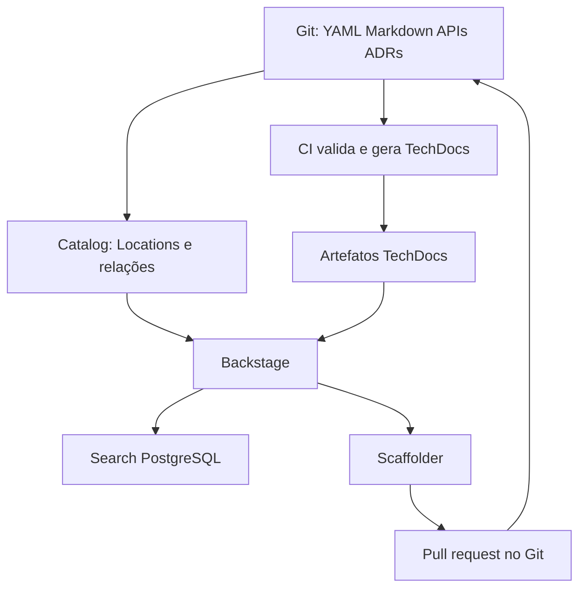

# Arquitetura

Backstage 1.54.0 foi gerado por @backstage/create-app 0.9.1; yarn.lock fixa as
versões resolvidas de plugins oficiais. Node 24 e Yarn 4.13 são independentes
do Maven e dos runtimes dos serviços. O frontend usa o novo sistema oficial.

Plugins: Catalog, API Docs, TechDocs, Catalog Graph, Org, Search PostgreSQL,
Scaffolder GitHub, Auth e User Settings. Não há Kubernetes, broker, MCP ou
plugins de demonstração no portal. Backstage não entra no caminho de requisições
dos serviços nem acessa tabelas dos livros.

## Persistência e ambientes

Local Node pode usar SQLite efêmero. Compose usa PostgreSQL 16 separado, com
volume backstage_postgres_data. Estado de catálogo é reconstruível dos arquivos;
histórico de tasks/auth é operacional e requer backup.

Local: MkDocs gera na demanda dentro do backend (sem Docker socket), publicando
em volume local. Produção: techdocs.builder=external; CI gera e publica no bucket
S3 dedicado. Ler docs não executa builds no backend público. S3 não é fonte autoral.

O Location raiz é explícito e revisável. Para dezenas de repositórios, adicione
Locations Git nesse índice ou adote provider GitHub com filtro de organização
quando houver necessidade; não é necessário instalar discovery de toda a organização.

No modo local, scripts/prepare-local.mjs produz .local/catalog.yaml ignorado pelo Git,
resolvendo `$text` de arquivos e preservando source-location original. O backend padrão
resolve placeholders por URL; esse artefato permite desenvolvimento offline sem servidor
HTTP de arquivos nem leitor inseguro de filesystem. Produção usa os YAML originais no Git.
