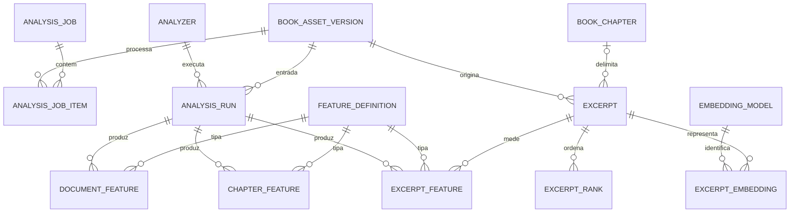
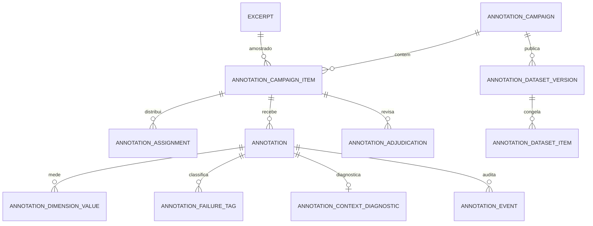
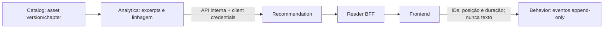

# Modelo de dados de Content Analytics

O schema PostgreSQL `analytics` pertence ao `book-analytics-service`. As migrations V1–V14 estão em `services/book-analytics-service/src/main/resources/db/migration`; Flyway as executa no ciclo do próprio serviço. Este documento descreve o modelo implementado no DDL e no código. Ter uma tabela ou definição de feature não prova que o dado tenha sido calculado em todos os ambientes.

## Fronteira, ownership e linhagem

O catálogo é dono da obra e do arquivo; analytics é dono das análises sobre uma versão física específica. As FKs para `catalog.book_asset_version` e `catalog.book_chapter` impedem que uma atualização de texto reescreva offsets, hashes ou observações históricas.

Um `excerpt` preserva `text_sha256`, offsets Unicode em code points no intervalo half-open `[start_codepoint, end_codepoint)`, contagens, método e versão do gerador. A chave única `(source_asset_version_id, start_codepoint, end_codepoint, generator_version)` torna o resultado idempotente e permite coexistir mais de uma estratégia. `body_eligible` e `exclusion_reason` guardam a decisão estrutural usada pelo feed, excluindo TOC, boilerplate do Gutenberg e headings isolados sem duplicar essa regra em recomendação.

## Execução e observações

| Grupo | Tabelas implementadas | Papel e invariantes principais |
| --- | --- | --- |
| Orquestração | `analysis_job`, `analysis_job_item`, `analysis_run`, `analyzer` | Job idempotente por `operation_key`/`request_hash`; item único por job e asset; run registra analyzer, configuração, hash, estágio e estado terminal. |
| Contrato de métricas | `feature_definition` | Catálogo versionado de métricas `DOCUMENT`, `CHAPTER` ou `EXCERPT`; categoria separa `MEASUREMENT`, `MODEL_INFERENCE` e `PRODUCT_SCORE`. |
| Observações | `document_feature`, `chapter_feature`, `excerpt_feature` | Uma observação por run/definição/entidade; exatamente um valor numérico, textual ou JSON. `value_status` evita representar modelo indisponível ou dado inválido como zero. |
| Seleção | `excerpt`, `excerpt_rank` | Texto candidato e score heurístico explicável, com componentes, pesos, versão e hash de configuração. O ranking não é evidência de qualidade editorial ou interesse do leitor. |
| Vetores | `embedding_model`, `document_embedding`, `chapter_embedding`, `excerpt_embedding` | Banco guarda identidade, dimensão, hash de entrada e referência S3; vetores não ficam como arrays PostgreSQL. |
| Proveniência | `model_artifact`, `corpus_frequency_model`, `style_normalization_model`, `prototype_set`, `topic_model` | Registra versões, corpus, checksums e artefatos usados ou elegíveis para uso. |

O worker toma itens com `FOR UPDATE SKIP LOCKED`, lê uma versão textual disponível, gera janelas alinhadas a sentenças, persiste excerpts/features e só então conclui o item. I/O de storage ocorre fora da transação curta de claim. Repetir a mesma chave e corpo recupera o job; reutilizar a chave com corpo diferente é conflito.

## Features e modelos conectados ao worker

O caminho determinístico grava métricas V1/V2 de contagem, frases, diálogo, pontuação, posição e diversidade lexical. Quando o runtime local devolve `VALID`, também persiste métricas linguísticas spaCy, embeddings BGE-M3, similaridade com protótipos e, se `ANALYTICS_NLI_ENABLED=true`, observações NLI narrativas/emocionais. Sem runtime ou artefato disponível, não há valor inventado.

`excerpt_rank` usa `EXCERPT_HEURISTIC_RANKER_V1`, com componentes e pesos persistidos. É um score técnico de ordenação. Valores NLI são `MODEL_INFERENCE` (entailment, neutral, contradiction, support e confidence), não probabilidade de engajamento nem decisão de produto. A fonte operacional para saber o que foi calculado é `analysis_run` concluído com observações `value_status='VALID'`.

## Qualidade de excerpts e rotulagem humana

V13 implementa uma cadeia independente para formar datasets de qualidade, sem misturar rótulos humanos com features automáticas.

`annotation_campaign` fixa protocolo, política de idioma, configuração e hash de amostragem. Um item é único por campanha/excerpt; uma pessoa pode ter no máximo uma assignment e uma annotation por item. Valores ordinais são 1–5 e distinguem `FIRST_SCREEN` de `FULL_EXCERPT`. A versão de dataset guarda manifest SHA-256 e snapshot de rótulos brutos/adjudicados, de modo que exportações futuras não dependem de mutar uma anotação antiga.

As APIs administrativas já suportam criar/amostrar/iniciar campanhas, claim, first-screen lock, submissão, métricas, fila de adjudicação e exportação de versões. A autorização exige papéis de operador, anotador ou revisor; não é uma API pública de leitores.

## Consumidores e isolamento

O `recommendation-service` consome excerpts elegíveis por API interna e retorna `FeedExcerpt` nullable. Ele prefere ranking compatível e usa fallback determinístico; o frontend usa excerpt, depois descrição e, por último, mensagem padrão. O navegador não chama analytics diretamente nem recebe credenciais de serviço.

Telemetria de impressão/abertura vai para `behavior`, não para `analytics`: `behavior.events` é a fonte append-only, `daily_book` e `daily_user_book` são projeções reconstruíveis, e `outbox` permite publicação posterior. Isso preserva a separação entre análise do conteúdo, seleção do produto e comportamento de leitores.

## Migrações existentes

| Versão | Entrega |
| --- | --- |
| V1–V2 | Fundação, excerpts, features, embeddings e jobs persistentes. |
| V3–V6 | Baseline determinístico, idempotência, status de observação, proveniência e ranking. |
| V7–V10 | Metadados V2 e definições estruturais, linguísticas, lexicais e spaCy. |
| V11–V12 | Definições NLI e similaridade com protótipos. |
| V13 | Campanhas, anotações, adjudicação e versões de dataset. |
| V14 | Elegibilidade estrutural persistida para excerpts. |

Para rotas, configuração e evidências de execução controlada, veja o [relatório operacional](report.md). Para a integração com o feed, veja [excerpts no feed](excerpt-feed-integration.md).
