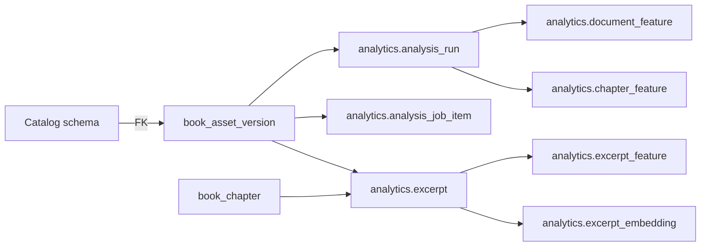

# Relatório operacional e schema da pipeline de analytics

**Data da inspeção:** 30 de setembro de 2026 (BRT)  
**Owner:** `book-analytics-service` / schema PostgreSQL `analytics`  
**Escopo:** estado implementado e dados persistidos; este documento não declara
prontidão para processamento em massa ou validação científica de modelos.

## Situação atual

A pipeline barata está operacional no ambiente atual. O serviço Spring Boot é o
único writer do schema `analytics`, o worker persistente está habilitado e o
modo offline está ativo. A execução não baixa modelos no startup.

A inspeção do PostgreSQL encontrou:

| Medida | Valor |
| --- | ---: |
| Jobs de analytics concluídos | 2 |
| Itens de job concluídos | 3 |
| Itens de job com falha | 0 |
| `analysis_run` concluídos | 2 |
| Versões textuais com excerpts | 2 |
| Excerpts persistidos | 6.153 |
| Features de excerpt persistidas | 30.765 |
| Features de documento persistidas | 0 |
| Features de capítulo persistidas | 0 |

O último job que processou duas versões textuais foi criado em 15/09/2026,
terminou com `COMPLETED`, processou 2/2 itens e não registrou falhas. Os dados
foram produzidos a partir da validação controlada dos livros Gutenberg 84 e
1342. O histórico de incidentes e o procedimento reprodutível estão em
[troubleshooting da pipeline](pipeline-troubleshooting.md).

## Fronteira e linhagem



O catálogo continua dono de `book`, `edition`, assets e versões físicas. Cada
entrada de analytics é uma FK para `catalog.book_asset_version`; não há análise
presa apenas a uma obra abstrata. Um excerpt armazena a versão de origem, hash
SHA-256, offsets Unicode em **code points** e intervalo half-open
`[start_codepoint, end_codepoint)`. Quando houver capítulo, ele também é uma FK
real para `catalog.book_chapter`.

Isso impede que uma nova versão de texto altere excerpts, offsets ou observações
históricas de outra versão.

## Fluxo executado

```text
TXT normalizado e versionado
  → job persistente e idempotente
  → analysis_run por asset version
  → geração de excerpts alinhados a sentenças
  → filtros e métricas determinísticas
  → feature/excerpt/ranking com proveniência
```

O job é identificado por `operation_key` e `request_hash`. Repetir a mesma
requisição recupera o job existente; reutilizar a mesma chave com outra entrada
retorna conflito. Itens falhos ou cancelados podem ser retomados sem apagar
histórico; o cancelamento é cooperativo.

A chave de entrada é sempre uma lista explícita de `book_asset_version_id`. O
serviço não descobre livros por conta própria e não inicia importação,
crawling ou processamento em massa no boot.

## Schema `analytics`

As migrations estão no caminho
`services/book-analytics-service/src/main/resources/db/migration` do checkout.
Elas são aditivas; V1–V6 não devem ser alteradas depois de aplicadas.

| Grupo | Tabelas | Responsabilidade |
| --- | --- | --- |
| Execução | `analysis_job`, `analysis_job_item`, `analysis_run`, `analyzer` | Fila persistente, tentativas, estágio, executor e configuração da execução. |
| Contrato de features | `feature_definition`, `document_feature`, `chapter_feature`, `excerpt_feature` | Definições semânticas e observações com escopo e FK real. |
| Trechos | `excerpt`, `excerpt_rank` | Texto candidato, offsets, hash, gerador e score explicável. |
| Embeddings | `embedding_model`, `document_embedding`, `chapter_embedding`, `excerpt_embedding` | Identidade de modelo, dimensão, hash de entrada e referência ao artefato externo. |
| Artefatos/modelos | `model_artifact`, `corpus_frequency_model`, `style_normalization_model`, `prototype_set`, `topic_model` | Reprodutibilidade de modelos, corpus, protótipos e classificadores. |
| Controle técnico | `flyway_schema_history` | Histórico de DDL do owner analytics. |

### Integridade e histórico

- FKs usam `ON DELETE RESTRICT` onde dados históricos dependem de catálogo,
  capítulo, versão textual, analyzer, feature, excerpt ou modelo.
- `analysis_job_item` é único por `(job_id, input_asset_version_id)`.
- Um excerpt é único por versão textual, intervalo e versão do gerador.
- Embeddings são únicos por entidade, modelo e hash da entrada.
- Observações usam tabelas por escopo; não há chave polimórfica
  `entity_type/entity_id` sem integridade.
- Valores de feature aceitam exatamente um entre número, texto ou JSON.
- `value_status` distingue `VALID`, `UNSUPPORTED`, `INVALID_INPUT`,
  `INSUFFICIENT_SAMPLE`, `MODEL_UNAVAILABLE` e `ERROR`; ausência de suporte não
  deve ser gravada como zero.

### Evolução das migrations

| Migration | Conteúdo |
| --- | --- |
| V1 | Fundação: analyzer, run, definição/observações de feature, excerpt e embeddings documento/excerpt. |
| V2 | Jobs persistentes, itens, cancelamento e contadores. |
| V3 | Analyzer e cinco definições determinísticas iniciais. |
| V4 | Registro de modelo de embedding desabilitado localmente. |
| V5 | Hash de requisição para idempotência. |
| V6 | Linhagem V1: artefatos de modelo, status de valor, embedding de capítulo, corpus, estilo, protótipos, tópicos e ranking. |

## Features efetivamente produzidas

A execução validada gerou cinco medições determinísticas por excerpt:

| Código | Semântica operacional atual |
| --- | --- |
| `word_count` | Contagem Unicode-aware de tokens. |
| `sentence_count` | Estimativa de fronteiras de sentença. |
| `question_ratio` | Perguntas divididas por sentenças estimadas. |
| `dialogue_ratio` | Caracteres em delimitadores de diálogo divididos por code points. |
| `estimated_read_time` | Palavras divididas por 200 palavras/minuto no baseline atualmente implementado. |

O contrato V1 contém mais métricas estruturais, lexicais, linguísticas,
semânticas e narrativas. Elas não devem ser consideradas calculadas só porque
têm definição, tabela ou migration. A ausência atual de
`document_feature` e `chapter_feature` confirma que a execução validada focou
features baratas de excerpt.

`excerpt_rank` suporta versão, hash de configuração, componentes, pesos e
motivo de exclusão. Quando usado, é uma ordenação heurística, explicitamente
não validada; não mede qualidade, engajamento, interesse ou probabilidade
comportamental.

## Modelos e modo offline

A configuração operacional atual mantém:

```text
ANALYTICS_WORKER_ENABLED=true
ANALYTICS_OFFLINE=true
ANALYTICS_MODEL_CACHE_DIR=/var/lib/bookrush/models
```

O contrato V1 prevê fastText para validação de idioma, spaCy EN/PT, BGE-M3 e um
modelo NLI multilíngue. Ainda faltam revisões imutáveis, checksums e artefatos
preparados para execução. Portanto, nesta fase não foram produzidos embeddings
BGE, scores de protótipos, NLI narrativo/emocional, vetores de estilo ou
classificação de tópicos. O serviço deve retornar indisponibilidade de modelo
ou status apropriado, e nunca baixar um artefato de forma implícita.

Veja [preparação de modelos](../analytics-models.md),
[contrato Content Analytics V1](../analytics-v1.md),
[ADR-004](../adr/ADR-004-analytics-ownership.md),
[ADR-005](../adr/ADR-005-analytics-embedding-storage.md) e
[ADR-010](../adr/ADR-010-analytics-owner-and-runtime.md).

## APIs

A base pública é `/analytics/api` através do gateway. As rotas administrativas
criam e controlam jobs; as internas leem dados ligados ao catálogo.

| Método | Rota | Finalidade |
| --- | --- | --- |
| POST | `/api/admin/v1/content-analytics/jobs` | Cria ou recupera job idempotente. |
| GET | `/api/admin/v1/content-analytics/jobs/{jobId}` | Estado e contadores persistidos. |
| POST | `/api/admin/v1/content-analytics/jobs/{jobId}/cancel` | Solicita cancelamento cooperativo. |
| GET | `/api/admin/v1/content-analytics/jobs/{jobId}/items` | Itens, tentativas e erros sanitizados. |
| GET | `/api/internal/v1/content-analytics/books/{bookId}` | Resumo por versões textuais. |
| GET | `/api/internal/v1/content-analytics/books/{bookId}/excerpts` | Excerpts paginados por livro. |
| GET | `/api/internal/v1/content-analytics/asset-versions/{assetVersionId}` | Observações/excerpts de uma versão exata. |
| GET | `/api/internal/v1/content-analytics/excerpts/{excerptId}` | Excerpt, hash e linhagem. |

`Idempotency-Key`, quando presente, deve ser igual a `operationKey`. A API
rejeita a mesma chave com corpo diferente. O contrato OpenAPI do serviço é a
fonte de detalhes de payload, autenticação e respostas.

## Operação e observabilidade

O serviço expõe health, info e métricas Spring Boot. Métricas operacionais
incluem criação/replay/conflito de jobs, itens processados, excerpts listados e
etapas de execução. Logs podem usar ID de job, versão de asset, analyzer e
estágio, mas não devem registrar tokens, segredos, URLs assinadas ou o texto
integral do livro.

Para uma nova execução controlada:

1. execute ingestão e confirme a versão TXT normalizada no catálogo;
2. crie um job com apenas os UUIDs das versões textuais desejadas;
3. acompanhe job e itens até estado terminal;
4. consulte excerpts por versão e valide hash/offset antes de ampliar lote;
5. execute `bash scripts/test-analytics-e2e.sh` em ambiente descartável antes
   de alterar configuração, modelo ou gerador.

## Limitações e próximos gates

A pipeline atual é adequada para validar persistência, linhagem, idempotência,
geração de excerpts e métricas baratas. Ela **não está aprovada para bulk**.

Antes de um lote maior, é necessário:

1. concluir `bookrush-av114`: congelar revisões, licenças e SHA-256 dos modelos;
2. preparar o cache por mecanismo explícito e validar execução offline;
3. implementar/validar os analyzers PT/EN, embeddings e NLI com tolerâncias;
4. construir corpus-frequency e normalização de estilo a partir de snapshot
   elegível e versionado;
5. executar os gates 1–8 de `VALIDATION_PLAN_V1.md` e registrar decisão GO;
6. medir throughput, storage e memória no piloto antes de iniciar qualquer
   corpus completo.

O princípio permanece: medições, scores de modelo e scores de produto têm
semânticas diferentes. Analytics V1 produz observações rastreáveis; não afirma
ter resolvido compreensão literária ou recomendação de usuários.
