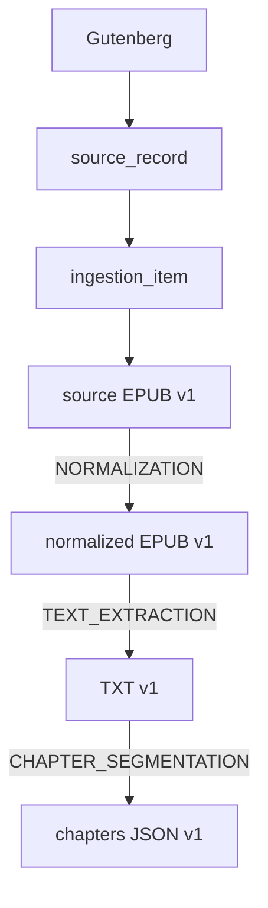

# Linhagem implementada em V6–V9

asset_processing registra uma tentativa de transformação entre versões físicas,
com processador, sua versão, tipo da operação, estado, horários, metadata JSONB
variável e erro. IDs e estado não ficam escondidos em JSON. Input é obrigatório;
output pode faltar em tentativa pendente/falha, mas é exigido em SUCCEEDED.
Tipo é um código extensível uppercase (ex.: NORMALIZATION, TEXT_EXTRACTION,
CHAPTER_SEGMENTATION), e não um enum fechado de todos os pipelines futuros.

V9 adiciona `processing_input` e `processing_output` como conjuntos ordenados de
entradas e saídas. Os campos unitários de V6 continuam preenchidos para
compatibilidade, e retries recebem novos IDs preservando as tentativas anteriores.
Todas as FKs são RESTRICT.

Autoaresta é rejeitada no banco. Ciclos indiretos não são bloqueados na DDL;
um futuro coordenador deve validá-los sob concorrência. As consultas recursivas
usam caminho visitado, reportam is_cycle e encerram aquele ramo para não travar
mesmo com dados incorretos. Essa detecção é testada com ciclo de duas versões.
Somente arestas SUCCEEDED participam da linhagem derivada.

A consulta recursiva executável está em [queries.sql](queries.sql). O caminho
reconstrói versões e processadores; a versão inicial chega à origem via
ingestion_item/source_record ou asset/source. O fixture não contém objetos S3
reais e os processadores ainda não foram implementados.
