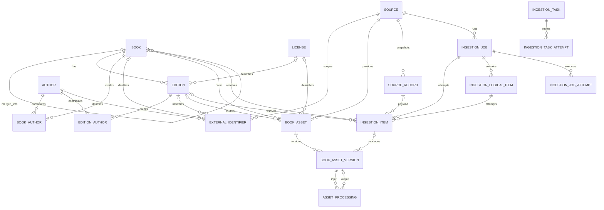

# Schema PostgreSQL do catálogo

Implementado no schema catalog, controlado exclusivamente por Flyway; Hibernate
valida os 14 mapeamentos. Book representa obra, edition manifestação, book_asset
arquivo lógico e book_asset_version localização física. PostgreSQL não armazena
livros binários, texto integral ou URLs assinadas.

| Migration | Responsabilidade |
|---|---|
| V1 | Schema e função de updated_at |
| V2 | book, author, edition, book_author, edition_author |
| V3 | source, license, external_identifier; licença da edição |
| V4 | book_asset e book_asset_version |
| V5 | source_record, ingestion_job, ingestion_item; origem da versão |
| V6 | asset_processing |
| V7 | logical ingestion items, job/task attempts, leases, fencing tokens, command idempotency and audit events |
| V8 | source revisions/observations, field provenance, Open Library author IDs and ISBN checksums |

## ER completo

As relações opcionais de identificador obedecem XOR; edição/obra e fonte/registro
original possuem FKs compostas além das relações apresentadas.

## Integridade e normalização

UUIDs independem de provedores; nomes e títulos não são únicos. Dados externos
incompletos podem permanecer NULL. IDs externos têm FK real e exatamente um
alvo, evitando associação polimórfica sem integridade. Edition não leva ISBN em
coluna própria, e book não leva publisher/formato. Créditos da edição evitam
atribuir um tradutor a todas as manifestações da obra.

Unicidade de créditos preserva posição, com constraint adiável para reordenar.
Edition(id,book_id) sustenta integridade composta de assets/itens. Versões são
únicas por asset/número e provider/bucket/key, mesmo após remoção lógica.
Hash não é unique. Checks rejeitam números negativos, SHA-256 inválido, estados
desconhecidos, datas finais anteriores ao início e contadores inconsistentes.
V7 preserva os itens de tentativa de V5 e cria `ingestion_logical_item` para a
unicidade job/chave sem invalidar tentativas históricas. `ingestion_task` mantém
operation key, lease, heartbeat e fence token; sua confirmação deve comparar o
token no commit.

Source_record usa JSONB somente no payload original; processamento em metadata
variável. Campos estruturais são relacionais. FK histórica usa RESTRICT; não há
CascadeType.ALL ou remoção em cascata. Apenas assets/versões têm estado DELETED,
sem mecanismo genérico de soft delete.

V8 mantém `source_record` como a revisão semântica selecionada e registra cada
aparência em `source_record_observation`, incluindo snapshot, hash bruto,
localizador RAW e anomalias. `field_provenance` conserva histórico por entidade e
campo, regra, confiança, decisão, valor anterior e ator. ISBN10/ISBN13 passaram a
usar funções imutáveis de checksum; identificadores de terceiros continuam
limitados ao contexto da fonte.

Limites explícitos: ciclos indiretos de merge/processamento exigem coordenação
futura; queries de linhagem detectam ciclos e terminam. DDL não implementa
autorização, cálculo de hash, máquina de estados, checksum ISBN, reconciliação,
imutabilidade física ou atribuição legal. O schema de capítulos será adicionado
quando o produtor de texto e o contrato de offsets forem implementados; V7 não
cria tabelas literárias.

Ver [campos](entities.md), [índices](indexes.md) e [ADR](../adr/ADR-001-book-storage-data-model.md).
