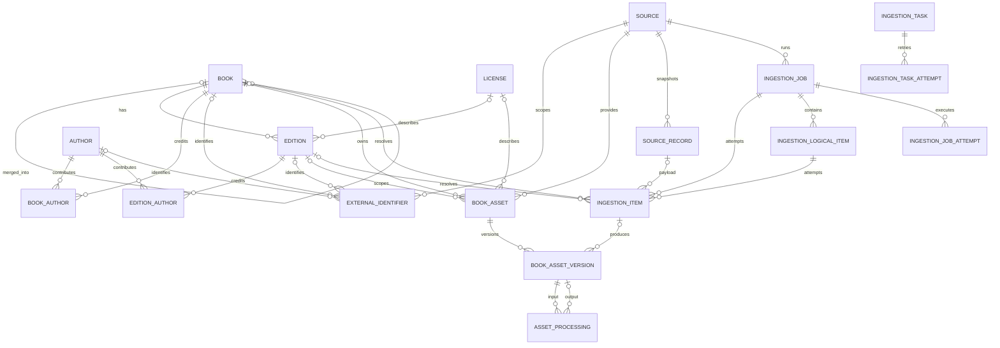
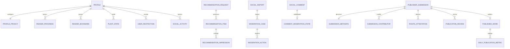

# Schema PostgreSQL do BookRush

O núcleo bibliográfico é implementado no schema `catalog`, controlado
exclusivamente por Flyway. `book` representa obra, `edition` manifestação,
`book_asset` arquivo lógico e `book_asset_version` localização física.
PostgreSQL não armazena livros binários, texto integral ou URLs assinadas.

| Migration | Responsabilidade |
|---|---|
| V1 | Schema e função de updated_at |
| V2 | book, author, edition, book_author, edition_author |
| V3 | source, license, external_identifier; licença da edição |
| V4 | book_asset e book_asset_version |
| V5 | source_record, ingestion_job, ingestion_item; origem da versão |
| V6 | asset_processing |
| V7 | logical ingestion items, job/task attempts, leases, fencing tokens, command idempotency and audit events |
| V8 | source revisions/observations, field provenance, Open Library author IDs and ISBN checksums |
| V9 | intents de storage e linhagem de processamento |
| V10 | decisões de direito de distribuição/processamento |
| V11 | projeção de capítulos por versão textual |
| V12 | compatibilidade de verificação de storage |
| V13 | execução dry-run e ajustes da projeção de capítulos |
| V14 | assuntos bibliográficos e relação livro–assunto |
| V15 | índices para busca por título, autor, assunto e descrição |

## ER completo

As relações opcionais de identificador obedecem XOR; edição/obra e fonte/registro
original possuem FKs compostas além das relações apresentadas.

```mermaid
erDiagram
    BOOK o|--o{ BOOK : merged_into
    BOOK ||--o{ EDITION : has
    BOOK ||--o{ BOOK_AUTHOR : credits
    AUTHOR ||--o{ BOOK_AUTHOR : contributes
    EDITION ||--o{ EDITION_AUTHOR : credits
    AUTHOR ||--o{ EDITION_AUTHOR : contributes
    LICENSE o|--o{ EDITION : describes
    SOURCE ||--o{ EXTERNAL_IDENTIFIER : scopes
    BOOK o|--o{ EXTERNAL_IDENTIFIER : identifies
    EDITION o|--o{ EXTERNAL_IDENTIFIER : identifies
    AUTHOR o|--o{ EXTERNAL_IDENTIFIER : identifies
    BOOK ||--o{ BOOK_ASSET : owns
    EDITION o|--o{ BOOK_ASSET : scopes
    SOURCE ||--o{ BOOK_ASSET : provides
    LICENSE o|--o{ BOOK_ASSET : describes
    BOOK_ASSET ||--o{ BOOK_ASSET_VERSION : versions
    SOURCE ||--o{ SOURCE_RECORD : snapshots
    SOURCE ||--o{ INGESTION_JOB : runs
    INGESTION_JOB ||--o{ INGESTION_ITEM : attempts
    INGESTION_JOB ||--o{ INGESTION_LOGICAL_ITEM : contains
    INGESTION_LOGICAL_ITEM ||--o{ INGESTION_ITEM : attempts
    INGESTION_JOB ||--o{ INGESTION_JOB_ATTEMPT : executes
    INGESTION_TASK ||--o{ INGESTION_TASK_ATTEMPT : retries
    SOURCE_RECORD o|--o{ INGESTION_ITEM : payload
    BOOK o|--o{ INGESTION_ITEM : resolves
    EDITION o|--o{ INGESTION_ITEM : resolves
    INGESTION_ITEM o|--o{ BOOK_ASSET_VERSION : produces
    BOOK_ASSET_VERSION ||--o{ ASSET_PROCESSING : input
    BOOK_ASSET_VERSION o|--o{ ASSET_PROCESSING : output
```

## Integridade e normalização

UUIDs independem de provedores; nomes e títulos não são únicos. Dados externos
incompletos podem permanecer NULL. IDs externos têm FK real e exatamente um
alvo, evitando associação polimórfica sem integridade. Edition não leva ISBN em
coluna própria, e book não leva publisher/formato. Créditos da edição evitam
atribuir um tradutor a todas as manifestações da obra.

Unicidade de créditos preserva posição, com constraint adiável para reordenar.
Edition(id,book_id) sustenta integridade composta de assets/itens. Versões são
únicas por asset/número e provider/bucket/key, mesmo após remoção lógica.
Hash não é unique. Checks rejeitam números negativos, SHA-256 inválido, estados
desconhecidos, datas finais anteriores ao início e contadores inconsistentes.
V7 preserva os itens de tentativa de V5 e cria `ingestion_logical_item` para a
unicidade job/chave sem invalidar tentativas históricas. `ingestion_task` mantém
operation key, lease, heartbeat e fence token; sua confirmação deve comparar o
token no commit.

Source_record usa JSONB somente no payload original; processamento em metadata
variável. Campos estruturais são relacionais. FK histórica usa RESTRICT; não há
CascadeType.ALL ou remoção em cascata. Apenas assets/versões têm estado DELETED,
sem mecanismo genérico de soft delete.

V8 mantém `source_record` como a revisão semântica selecionada e registra cada
aparência em `source_record_observation`, incluindo snapshot, hash bruto,
localizador RAW e anomalias. `field_provenance` conserva histórico por entidade e
campo, regra, confiança, decisão, valor anterior e ator. ISBN10/ISBN13 passaram a
usar funções imutáveis de checksum; identificadores de terceiros continuam
limitados ao contexto da fonte.

Limites explícitos: ciclos indiretos de merge/processamento exigem coordenação
futura; queries de linhagem detectam ciclos e terminam. DDL não implementa
autorização, cálculo de hash, máquina de estados, checksum ISBN, reconciliação,
imutabilidade física ou atribuição legal. A projeção `book_chapter` já vincula
capítulo, edição e versão textual por offsets; a aplicação ainda é responsável
por validar que o locator de leitura segue o contrato da publicação.

Ver [campos](entities.md), [índices](indexes.md) e [ADR](../adr/ADR-001-book-storage-data-model.md).

## Modelo de dados das histórias de usuário

As migrations abaixo implementam o modelo relacional complementar para as
histórias de leitor, administrador e publicador. Elas são aditivas e mantêm os
contratos existentes: nenhuma coluna nova de leitura/recomendação é obrigatória
até que a respectiva API passe a produzi-la.

| Serviço dono | Migration | Estruturas introduzidas |
|---|---|---|
| `reader-profile-service` | V3 | `profile_privacy`: visibilidade de perfil, atividade, biblioteca, recentes e grafo social. |
| `reader-state-service` | V5 | Locator versionado em progresso/marcador e `plant_state` versionado. |
| `recommendation-service` | V3 | Estratégia/seed de request e `recommendation.item`, ligado ao ledger de impressões. |
| `social-service` | V6 | `comment_moderation_state` e feed append-only `social.activity`. |
| `admin-service` | V4 | `moderation_case`, `moderation_action` e `user_restriction` idempotente para comandos ao Keycloak. |
| `publisher-service` | V6 | Metadata, contributors, declaração de direitos, revisão, `published_work` e métricas diárias. |
| `behavior-service` | V7 | Contadores de compartilhamentos e comentários nas projeções diárias. |

### Ownership e integridade

`catalog` continua dono de obra, edição, assets, capítulos e direitos;
`reader_state` é dono de estado privado de leitura; `reader_profile` é dono da
política de privacidade; `social` é dono da interação; `recommendation` é dono
da seleção/entrega; `publisher` é dono do workflow de submissão; `admin` é dono
de decisões administrativas; e `behavior` é dono de eventos e agregados
reconstruíveis.

As relações entre esses schemas são identificadores contratuais, não FKs
cross-schema. Isso permite que os serviços sejam migrados e implantados de modo
independente. FKs são aplicadas quando ambas as tabelas são do mesmo dono (por
exemplo, `recommendation.item → recommendation.request` e
`publisher.published_work → publisher.submission`).

O Keycloak é dono de autenticação, senhas e papéis. `admin.user_restriction`
não replica credenciais nem finge suspender uma conta: armazena o comando
idempotente, seu estado e a confirmação do IdP.

### Diagrama E/R — extensões de produto

```mermaid
erDiagram
    PROFILE ||--|| PROFILE_PRIVACY : configura
    PROFILE ||--o{ READER_PROGRESS : possui
    PROFILE ||--o{ READER_BOOKMARK : possui
    PROFILE ||--o{ PLANT_STATE : mede
    RECOMMENDATION_REQUEST ||--o{ RECOMMENDATION_ITEM : seleciona
    RECOMMENDATION_ITEM ||--o{ RECOMMENDATION_IMPRESSION : entrega
    SOCIAL_REPORT ||--o{ MODERATION_CASE : origina
    MODERATION_CASE ||--o{ MODERATION_ACTION : registra
    PROFILE ||--o{ USER_RESTRICTION : recebe
    SOCIAL_COMMENT ||--o| COMMENT_MODERATION_STATE : visibilidade
    PROFILE ||--o{ SOCIAL_ACTIVITY : pratica
    PUBLISHER_SUBMISSION ||--|| SUBMISSION_METADATA : descreve
    PUBLISHER_SUBMISSION ||--o{ SUBMISSION_CONTRIBUTOR : credita
    PUBLISHER_SUBMISSION ||--o{ RIGHTS_ATTESTATION : declara
    PUBLISHER_SUBMISSION ||--o{ PUBLICATION_REVIEW : revisa
    PUBLISHER_SUBMISSION ||--o| PUBLISHED_WORK : publica
    PUBLISHED_WORK ||--o{ DAILY_PUBLICATION_METRIC : agrega
```

### Entidades novas e evolução das existentes

| Estrutura | Chave e campos essenciais | Regra de negócio garantida pelo banco |
|---|---|---|
| `reader_profile.profile_privacy` | `subject_key`; cinco visibilidades | Valores apenas `PUBLIC`, `FOLLOWERS`, `PRIVATE`; migração inicial deriva a política do antigo `is_public`. |
| `reader_state.progress` / `bookmarks` | `subject_key`, `book_id`, versão/chapter/`locator` | `locator`, se presente, é JSON objeto; offsets legados continuam válidos. |
| `reader_state.plant_state` | `subject_key`, `formula_version`, estágio e minutos | Métricas não negativas e fórmula explicitamente versionada. |
| `recommendation.request` / `item` | estratégia, seed, hash de candidatos, rank, score, razão | Estratégia limitada; rank e livro únicos dentro de cada request. |
| `social.comment_moderation_state` | `comment_id`, visibilidade | Comentário não é deletado para moderar; o estado conserva a referência ao caso. |
| `social.activity` | ator, tipo, alvo e visibility snapshot | Feed é append-only, com alvo obrigatório e índices por ator/livro. |
| `admin.moderation_case` / `action` | alvo tipado, estado, decisão, evidência | Só tipos de alvo e decisões conhecidas; resolução exige data. |
| `admin.user_restriction` | alvo, command key, estado e confirmação | Comando ao Keycloak é único/idempotente; expiração é posterior ao pedido. |
| `publisher.*` | metadata, contributor, attestation, review, published work | Contributor ordenado, direitos únicos por território e uma obra publicada por submissão. |
| `publisher.daily_publication_metric` | dia + published work | Métricas nunca negativas e são projeção reconstruível. |

### Compatibilidade e backfill

- `profile_privacy` é preenchida a partir de `profile.is_public`; a coluna
  antiga fica disponível durante a transição da API.
- `recommendation.item` recebe um item sintético para cada impressão legada e
  `impression.item_id` é preenchido sem remover `request_id`, `book_id` ou
  `rank` legados.
- Locators de leitura, capítulos, versão textual, score e excerpt são nullable
  inicialmente para não quebrar clientes existentes. A API deve passar a
  escrevê-los antes de qualquer futura migração para `NOT NULL`.
- As referências a catálogo, analytics, social reports e Keycloak não recebem
  FK física porque pertencem a serviços distintos. Os consumidores precisam
  validar a existência por contrato e processar eventos de remoção/moderação.

O detalhamento de cobertura por história, decisões de produto e evolução de
APIs está em [user-stories-data-model.md](user-stories-data-model.md).
