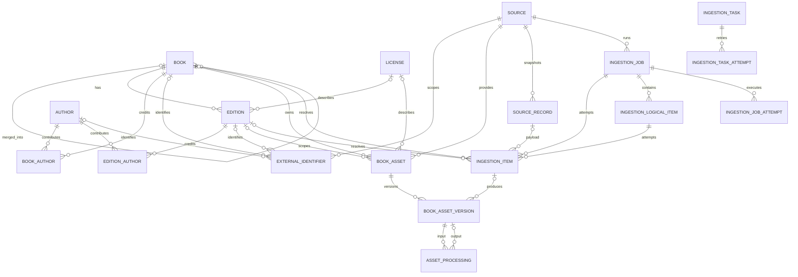
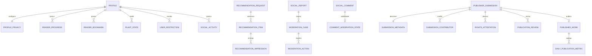
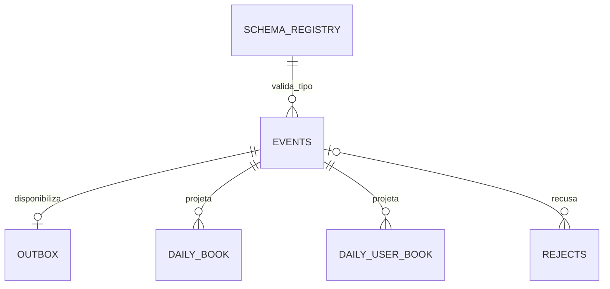

# Schema PostgreSQL do BookRush

O núcleo bibliográfico é implementado no schema `catalog`, controlado
exclusivamente por Flyway. `book` representa obra, `edition` manifestação,
`book_asset` arquivo lógico e `book_asset_version` localização física.
PostgreSQL não armazena livros binários, texto integral ou URLs assinadas.

| Migration | Responsabilidade |
|---|---|
| V1 | Schema e função de updated_at |
| V2 | book, author, edition, book_author, edition_author |
| V3 | source, license, external_identifier; licença da edição |
| V4 | book_asset e book_asset_version |
| V5 | source_record, ingestion_job, ingestion_item; origem da versão |
| V6 | asset_processing |
| V7 | logical ingestion items, job/task attempts, leases, fencing tokens, command idempotency and audit events |
| V8 | source revisions/observations, field provenance, Open Library author IDs and ISBN checksums |
| V9 | intents de storage e linhagem de processamento |
| V10 | decisões de direito de distribuição/processamento |
| V11 | projeção de capítulos por versão textual |
| V12 | compatibilidade de verificação de storage |
| V13 | execução dry-run e ajustes da projeção de capítulos |
| V14 | assuntos bibliográficos e relação livro–assunto |
| V15 | índices para busca por título, autor, assunto e descrição |

## ER completo

As relações opcionais de identificador obedecem XOR; edição/obra e fonte/registro
original possuem FKs compostas além das relações apresentadas.

```mermaid
erDiagram
    BOOK o|--o{ BOOK : merged_into
    BOOK ||--o{ EDITION : has
    BOOK ||--o{ BOOK_AUTHOR : credits
    AUTHOR ||--o{ BOOK_AUTHOR : contributes
    EDITION ||--o{ EDITION_AUTHOR : credits
    AUTHOR ||--o{ EDITION_AUTHOR : contributes
    LICENSE o|--o{ EDITION : describes
    SOURCE ||--o{ EXTERNAL_IDENTIFIER : scopes
    BOOK o|--o{ EXTERNAL_IDENTIFIER : identifies
    EDITION o|--o{ EXTERNAL_IDENTIFIER : identifies
    AUTHOR o|--o{ EXTERNAL_IDENTIFIER : identifies
    BOOK ||--o{ BOOK_ASSET : owns
    EDITION o|--o{ BOOK_ASSET : scopes
    SOURCE ||--o{ BOOK_ASSET : provides
    LICENSE o|--o{ BOOK_ASSET : describes
    BOOK_ASSET ||--o{ BOOK_ASSET_VERSION : versions
    SOURCE ||--o{ SOURCE_RECORD : snapshots
    SOURCE ||--o{ INGESTION_JOB : runs
    INGESTION_JOB ||--o{ INGESTION_ITEM : attempts
    INGESTION_JOB ||--o{ INGESTION_LOGICAL_ITEM : contains
    INGESTION_LOGICAL_ITEM ||--o{ INGESTION_ITEM : attempts
    INGESTION_JOB ||--o{ INGESTION_JOB_ATTEMPT : executes
    INGESTION_TASK ||--o{ INGESTION_TASK_ATTEMPT : retries
    SOURCE_RECORD o|--o{ INGESTION_ITEM : payload
    BOOK o|--o{ INGESTION_ITEM : resolves
    EDITION o|--o{ INGESTION_ITEM : resolves
    INGESTION_ITEM o|--o{ BOOK_ASSET_VERSION : produces
    BOOK_ASSET_VERSION ||--o{ ASSET_PROCESSING : input
    BOOK_ASSET_VERSION o|--o{ ASSET_PROCESSING : output
```

## Integridade e normalização

UUIDs independem de provedores; nomes e títulos não são únicos. Dados externos
incompletos podem permanecer NULL. IDs externos têm FK real e exatamente um
alvo, evitando associação polimórfica sem integridade. Edition não leva ISBN em
coluna própria, e book não leva publisher/formato. Créditos da edição evitam
atribuir um tradutor a todas as manifestações da obra.

Unicidade de créditos preserva posição, com constraint adiável para reordenar.
Edition(id,book_id) sustenta integridade composta de assets/itens. Versões são
únicas por asset/número e provider/bucket/key, mesmo após remoção lógica.
Hash não é unique. Checks rejeitam números negativos, SHA-256 inválido, estados
desconhecidos, datas finais anteriores ao início e contadores inconsistentes.
V7 preserva os itens de tentativa de V5 e cria `ingestion_logical_item` para a
unicidade job/chave sem invalidar tentativas históricas. `ingestion_task` mantém
operation key, lease, heartbeat e fence token; sua confirmação deve comparar o
token no commit.

Source_record usa JSONB somente no payload original; processamento em metadata
variável. Campos estruturais são relacionais. FK histórica usa RESTRICT; não há
CascadeType.ALL ou remoção em cascata. Apenas assets/versões têm estado DELETED,
sem mecanismo genérico de soft delete.

V8 mantém `source_record` como a revisão semântica selecionada e registra cada
aparência em `source_record_observation`, incluindo snapshot, hash bruto,
localizador RAW e anomalias. `field_provenance` conserva histórico por entidade e
campo, regra, confiança, decisão, valor anterior e ator. ISBN10/ISBN13 passaram a
usar funções imutáveis de checksum; identificadores de terceiros continuam
limitados ao contexto da fonte.

Limites explícitos: ciclos indiretos de merge/processamento exigem coordenação
futura; queries de linhagem detectam ciclos e terminam. DDL não implementa
autorização, cálculo de hash, máquina de estados, checksum ISBN, reconciliação,
imutabilidade física ou atribuição legal. A projeção `book_chapter` já vincula
capítulo, edição e versão textual por offsets; a aplicação ainda é responsável
por validar que o locator de leitura segue o contrato da publicação.

Ver [campos](entities.md), [índices](indexes.md) e [ADR](../adr/ADR-001-book-storage-data-model.md).

## Modelo de dados das histórias de usuário

As migrations abaixo implementam o modelo relacional complementar para as
histórias de leitor, administrador e publicador. Elas são aditivas e mantêm os
contratos existentes: nenhuma coluna nova de leitura/recomendação é obrigatória
até que a respectiva API passe a produzi-la.

| Serviço dono | Migration | Estruturas introduzidas |
|---|---|---|
| `reader-profile-service` | V3 | `profile_privacy`: visibilidade de perfil, atividade, biblioteca, recentes e grafo social. |
| `reader-state-service` | V5 | Locator versionado em progresso/marcador e `plant_state` versionado. |
| `recommendation-service` | V3 | Estratégia/seed de request e `recommendation.item`, ligado ao ledger de impressões. |
| `social-service` | V6 | `comment_moderation_state` e feed append-only `social.activity`. |
| `admin-service` | V4 | `moderation_case`, `moderation_action` e `user_restriction` idempotente para comandos ao Keycloak. |
| `publisher-service` | V6 | Metadata, contributors, declaração de direitos, revisão, `published_work` e métricas diárias. |
| `behavior-service` | V7 | Contadores de compartilhamentos e comentários nas projeções diárias. |

### Ownership e integridade

`catalog` continua dono de obra, edição, assets, capítulos e direitos;
`reader_state` é dono de estado privado de leitura; `reader_profile` é dono da
política de privacidade; `social` é dono da interação; `recommendation` é dono
da seleção/entrega; `publisher` é dono do workflow de submissão; `admin` é dono
de decisões administrativas; e `behavior` é dono de eventos e agregados
reconstruíveis.

As relações entre esses schemas são identificadores contratuais, não FKs
cross-schema. Isso permite que os serviços sejam migrados e implantados de modo
independente. FKs são aplicadas quando ambas as tabelas são do mesmo dono (por
exemplo, `recommendation.item → recommendation.request` e
`publisher.published_work → publisher.submission`).

O Keycloak é dono de autenticação, senhas e papéis. `admin.user_restriction`
não replica credenciais nem finge suspender uma conta: armazena o comando
idempotente, seu estado e a confirmação do IdP.

### Diagrama E/R — extensões de produto

```mermaid
erDiagram
    PROFILE ||--|| PROFILE_PRIVACY : configura
    PROFILE ||--o{ READER_PROGRESS : possui
    PROFILE ||--o{ READER_BOOKMARK : possui
    PROFILE ||--o{ PLANT_STATE : mede
    RECOMMENDATION_REQUEST ||--o{ RECOMMENDATION_ITEM : seleciona
    RECOMMENDATION_ITEM ||--o{ RECOMMENDATION_IMPRESSION : entrega
    SOCIAL_REPORT ||--o{ MODERATION_CASE : origina
    MODERATION_CASE ||--o{ MODERATION_ACTION : registra
    PROFILE ||--o{ USER_RESTRICTION : recebe
    SOCIAL_COMMENT ||--o| COMMENT_MODERATION_STATE : visibilidade
    PROFILE ||--o{ SOCIAL_ACTIVITY : pratica
    PUBLISHER_SUBMISSION ||--|| SUBMISSION_METADATA : descreve
    PUBLISHER_SUBMISSION ||--o{ SUBMISSION_CONTRIBUTOR : credita
    PUBLISHER_SUBMISSION ||--o{ RIGHTS_ATTESTATION : declara
    PUBLISHER_SUBMISSION ||--o{ PUBLICATION_REVIEW : revisa
    PUBLISHER_SUBMISSION ||--o| PUBLISHED_WORK : publica
    PUBLISHED_WORK ||--o{ DAILY_PUBLICATION_METRIC : agrega
```

### Entidades novas e evolução das existentes

| Estrutura | Chave e campos essenciais | Regra de negócio garantida pelo banco |
|---|---|---|
| `reader_profile.profile_privacy` | `subject_key`; cinco visibilidades | Valores apenas `PUBLIC`, `FOLLOWERS`, `PRIVATE`; migração inicial deriva a política do antigo `is_public`. |
| `reader_state.progress` / `bookmarks` | `subject_key`, `book_id`, versão/chapter/`locator` | `locator`, se presente, é JSON objeto; offsets legados continuam válidos. |
| `reader_state.plant_state` | `subject_key`, `formula_version`, estágio e minutos | Métricas não negativas e fórmula explicitamente versionada. |
| `recommendation.request` / `item` | estratégia, seed, hash de candidatos, rank, score, razão | Estratégia limitada; rank e livro únicos dentro de cada request. |
| `social.comment_moderation_state` | `comment_id`, visibilidade | Comentário não é deletado para moderar; o estado conserva a referência ao caso. |
| `social.activity` | ator, tipo, alvo e visibility snapshot | Feed é append-only, com alvo obrigatório e índices por ator/livro. |
| `admin.moderation_case` / `action` | alvo tipado, estado, decisão, evidência | Só tipos de alvo e decisões conhecidas; resolução exige data. |
| `admin.user_restriction` | alvo, command key, estado e confirmação | Comando ao Keycloak é único/idempotente; expiração é posterior ao pedido. |
| `publisher.*` | metadata, contributor, attestation, review, published work | Contributor ordenado, direitos únicos por território e uma obra publicada por submissão. |
| `publisher.daily_publication_metric` | dia + published work | Métricas nunca negativas e são projeção reconstruível. |

### Compatibilidade e backfill

- `profile_privacy` é preenchida a partir de `profile.is_public`; a coluna
  antiga fica disponível durante a transição da API.
- `recommendation.item` recebe um item sintético para cada impressão legada e
  `impression.item_id` é preenchido sem remover `request_id`, `book_id` ou
  `rank` legados.
- Locators de leitura, capítulos, versão textual, score e excerpt são nullable
  inicialmente para não quebrar clientes existentes. A API deve passar a
  escrevê-los antes de qualquer futura migração para `NOT NULL`.
- As referências a catálogo, analytics, social reports e Keycloak não recebem
  FK física porque pertencem a serviços distintos. Os consumidores precisam
  validar a existência por contrato e processar eventos de remoção/moderação.

O detalhamento de cobertura por história, decisões de produto e evolução de
APIs está em [user-stories-data-model.md](user-stories-data-model.md).

## Analytics de conteúdo

`analytics` é um schema separado, migrado pelo `book-analytics-service`. Ele
tem FK para versões e capítulos do `catalog`, mas é o dono exclusivo de jobs,
runs, excerpts, features, embeddings, ranking e datasets de anotação. A
referência é sempre a versão textual exata — nunca somente `book_id` — para que
offsets, hashes e observações coexistam quando um arquivo é substituído.

O modelo completo, diagramas E/R, invariantes e fronteira com
recomendação/telemetria estão em [Analytics: modelo de dados](../analytics/data-model.md).

## Inventário completo do banco

Esta seção é a referência do estado de DDL versionado no repositório. Ela cobre
todos os schemas declarados nas migrations dos serviços; não presume tabelas
criadas manualmente nem estruturas de extensões do PostgreSQL. Cada serviço é o
único writer do seu schema e mantém sua própria `flyway_schema_history` no
schema configurado. `public` não pertence ao domínio do BookRush e não deve
ser usado para entidades de produto.

Os diagramas E/R também estão exportados em SVG vetorial para relatórios em
[diagramas do banco](diagrams/README.md). As fontes Mermaid continuam nos
documentos Markdown, para que imagens futuras possam ser regeneradas.

| Schema | Serviço owner | Última migration | Estado |
| --- | --- | --- | --- |
| `catalog` | `catalog-service` | V15 | Biblioteca, assets, ingestão, storage, capítulos, direitos e busca. |
| `analytics` | `book-analytics-service` | V14 | Análise de conteúdo, embeddings, ranking e rotulagem humana. |
| `behavior` | `behavior-service` | V7 | Eventos append-only, rejeições, outbox e agregados reconstruíveis. |
| `reader_state` | `reader-state-service` | V5 | Biblioteca particular, leitura, sessão, streak e planta. |
| `reader_profile` | `reader-profile-service` | V3 | Perfil público e política de privacidade. |
| `recommendation` | `recommendation-service` | V3 | Requisições, itens selecionados e impressões. |
| `social` | `social-service` | V6 | Curtidas, seguimentos, comentários, denúncias, compartilhamentos e atividade. |
| `publisher` | `publisher-service` | V6 | Submissão, uploads, direitos, revisão, publicação e métricas. |
| `admin` | `admin-service` | V4 | Auditoria, moderação e restrições no IdP. |
| `book_content` | `book-content-service` | V1 | Apenas schema declarado; não há tabela nem datasource/Flyway configurado pelo serviço atualmente. |

As chaves `subject_key`, `identity_subject`, `actor_subject` e equivalentes são
identificadores de sujeito do OIDC/Keycloak, não cópias de credenciais, e-mails
ou perfis. IDs de outro bounded context são referências contratuais salvo quando
o DDL mostra explicitamente uma FK: evitar criar FKs cross-schema por
conveniência, pois os serviços evoluem e são implantados de forma independente.

### `catalog` — bibliografia, ingestão e storage

O catálogo tem migrations V1–V15. A coluna não qualificada abaixo pertence a
`catalog`, pois Flyway usa esse schema como `default-schema`.

| Grupo | Tabelas | Chaves e responsabilidades |
| --- | --- | --- |
| Bibliografia | `book`, `author`, `edition`, `book_author`, `edition_author` | Obra, pessoa, manifestação e créditos ordenados. `edition` pertence a uma obra; créditos preservam papel e posição; uma obra mesclada aponta para outra por `merged_into_id`. |
| Vocabulário externo | `source`, `license`, `external_identifier` | Fonte e licença reutilizáveis; identificador externo aponta para exatamente uma obra, edição ou autor e valida formato/escopo, inclusive checksums ISBN. |
| Arquivos | `book_asset`, `book_asset_version` | Asset lógico de uma obra/edição e versões físicas S3. Versão é única por asset/número e por provider/bucket/key; `current_version_id` pertence ao asset e referencia a mesma família. |
| Proveniência de ingestão | `source_record`, `source_record_observation`, `field_provenance` | Snapshot selecionado de metadados, observações por revisão e decisão de cada campo. JSONB guarda somente material variável/original com checks de tipo. |
| Orquestração de ingestão | `ingestion_job`, `ingestion_job_attempt`, `ingestion_logical_item`, `ingestion_item`, `ingestion_task`, `ingestion_task_attempt`, `ingestion_command_result`, `audit_event` | Jobs e tentativas, item lógico idempotente, leases/fence tokens, resultado de comando e trilha de auditoria. `operation_key` é único e a finalização deve conferir o token de fencing. |
| Processamento e storage | `asset_processing`, `processing_input`, `processing_output`, `storage_intent` | Linhagem de transformação N:N, hash de cada entrada/saída e intenção durável de escrita/exclusão em storage. |
| Leitura/publicação | `book_chapter`, `rights_decision` | Capítulo é projeção de uma versão textual com offsets; decisão de direito recai em edição **ou** asset, nunca ambos. |
| Assuntos e busca | `subject`, `book_subject` | Taxonomia hierárquica e associação obra–assunto com fonte, confiança e método. Índices V15 atendem título, autor, assunto e descrição. |

`book_asset_version` só pode estar disponível quando metadados físicos e
verificação são válidos; `availability_status`, `verified_at` e
`verification_method` complementam o estado legado. O banco não armazena o
binário do livro, conteúdo completo ou URL assinada: conserva somente o
localizador S3 e metadados de integridade. Os triggers de `updated_at` usam o
relógio do banco.

### `analytics` — conteúdo e aprendizado de qualidade

| Grupo | Tabelas | Chaves e responsabilidades |
| --- | --- | --- |
| Execução | `analyzer`, `analysis_job`, `analysis_job_item`, `analysis_run` | Analyzer versionado, job idempotente, item por asset e run por versão textual/configuração. |
| Observações | `feature_definition`, `document_feature`, `chapter_feature`, `excerpt_feature` | Definição com escopo/tipo/categoria e observação tipada por run. Exatamente um valor numérico, texto ou JSON; status distingue indisponibilidade de zero. |
| Trechos/ranking | `excerpt`, `excerpt_rank` | Janela textual com offsets code point, hash e versão do gerador; ranking explicável por componentes, pesos e hash de configuração. |
| Embeddings/modelos | `embedding_model`, `document_embedding`, `chapter_embedding`, `excerpt_embedding`, `model_artifact`, `corpus_frequency_model`, `style_normalization_model`, `prototype_set`, `topic_model` | Linhagem de artefato, corpus e modelo. Vetores ficam no object storage; o banco guarda identidade, dimensão, hash de entrada e chave do objeto. |
| Anotação humana | `annotation_campaign`, `annotation_campaign_item`, `annotation_assignment`, `annotation`, `annotation_dimension_value`, `annotation_failure_tag`, `annotation_context_diagnostic`, `annotation_event`, `annotation_adjudication`, `annotation_dataset_version`, `annotation_dataset_item` | Amostra, atribuição, rótulo cego, lock, diagnóstico pós-contexto, auditoria, revisão e snapshot de dataset com manifest SHA-256. |

`analytics.excerpt` referencia fisicamente a versão e, opcionalmente, o capítulo
do `catalog`; seus dados nunca são reatribuídos a uma versão textual posterior.
`body_eligible`/`exclusion_reason` preservam o filtro editorial estrutural para
o consumo interno pelo feed. O detalhamento completo, incluindo E/R e quais
saídas foram realmente produzidas, está em [Analytics: modelo de dados](../analytics/data-model.md).

### `behavior` — eventos de produto

```mermaid
erDiagram
    SCHEMA_REGISTRY ||--o{ EVENTS : valida_tipo
    EVENTS ||--o| OUTBOX : disponibiliza
    EVENTS ||--o{ DAILY_BOOK : projeta
    EVENTS ||--o{ DAILY_USER_BOOK : projeta
    EVENTS o|--o{ REJECTS : recusa
```

As arestas desse diagrama mostram a relação operacional. Apenas `outbox.event_id`
tem unicidade com o ID do evento; agregados e rejeições não recebem FK para
preservar a ingestão append-only e a reconstrução independente.

| Tabela | Chave e conteúdo | Garantia |
| --- | --- | --- |
| `events` | `id`, `event_key` único, sujeito, livro, payload e tempos | Fonte append-only e idempotência de ingestão por `event_key`. |
| `rejects` | Evento recusado, motivo e payload | Erro de validação não desaparece nem entra no fluxo analítico. |
| `schema_registry` | Tipo de evento, versão/hash e flag ativa | Registro de contrato de payload. |
| `daily_book` | `(day, book_id)` | Projeção diária de impressões, aberturas, likes, leituras, compartilhamentos e comentários. |
| `daily_user_book` | `(day, identity_subject, book_id)` | Projeção privada diária, incluindo segundos ativos. |
| `outbox` | `event_id` único, payload e `published_at` | Uma linha por fato aceito para entrega posterior; não substitui `events`. |

As tabelas diárias são reconstruíveis e não devem ser tratadas como fonte de
verdade, perfil de usuário ou evidência de autorização.

### `reader_state` e `reader_profile` — leitor e privacidade

| Schema | Tabelas | Chaves e responsabilidades |
| --- | --- | --- |
| `reader_state` | `library` | `(subject_key, book_id)` com estado de biblioteca do leitor. |
| `reader_state` | `progress`, `bookmarks` | Progresso e marcador por leitor/livro; locator JSON, versão textual e capítulo são opcionais e o JSON deve ser objeto. |
| `reader_state` | `reading_day`, `recent`, `session`, `plant_state` | Streak diário, últimos abertos, sessão temporal e projeção versionada da planta. Valores de planta e duração não aceitam negativos. |
| `reader_profile` | `profile` | Perfil mínimo por sujeito, com display name, bio e flag legada `is_public`. |
| `reader_profile` | `profile_privacy` | Relação 1:1 com perfil; visibilidades de perfil, atividade, biblioteca, recentes e grafo social em `PUBLIC`, `FOLLOWERS` ou `PRIVATE`. |

Não há FK física de `reader_state` para o catálogo nem para o perfil porque os
owners são diferentes. A aplicação valida esses IDs por contrato e processa
eventos de remoção/moderação quando necessários.

### `recommendation` — decisão e entrega

| Tabela | Chave e conteúdo | Garantia |
| --- | --- | --- |
| `request` | Request de feed, sujeito opcional, versão de modelo, estratégia, seed, hash de candidatos e contexto | Estratégia limitada a `PERSONALIZED`, `RANDOM`, `TRENDING` ou `FEED`; contexto é objeto JSON. |
| `item` | Item selecionado, request, livro, excerpt opcional, rank, score e razão | Rank e livro são únicos dentro da requisição; `excerpt_id` é contrato com analytics. |
| `impression` | Entrega observável de item/request/livro/rank e `viewable` | Ledger histórico. Backfill V3 mantém os campos legados e associa cada impressão a um item. |

O schema não é dono do texto do excerpt nem do evento comportamental: seleção e
exposição pertencem a `recommendation`, conteúdo a `analytics`, e fatos de uso
a `behavior`.

### `social` — relações e moderação de interação

| Tabela | Chave e conteúdo | Garantia |
| --- | --- | --- |
| `likes`, `follows` | Chaves compostas por sujeitos/livro ou seguidor/seguido | Uma interação por par. |
| `comments` | UUID, autor técnico, livro, corpo até 2.000 caracteres e snapshot de display name | O snapshot não substitui a identidade OIDC. |
| `reports` | Denúncia por livro ou comentário | Registra denunciante, motivo e status. |
| `shares` | UUID, sujeito, livro e canal | Canal limitado a 40 caracteres. |
| `comment_moderation_state` | 1:1 com comentário | Visibilidade `VISIBLE`, `HIDDEN` ou `REMOVED`, sem apagar o comentário histórico. |
| `activity` | Fato append-only de ator, tipo, alvo e visibilidade calculada | Ao menos um alvo entre livro, comentário ou sujeito; índices atendem feed por ator/livro. |

`moderation_case_id` em `comment_moderation_state` é uma referência contratual a
`admin`; não é FK cross-schema.

### `publisher` — submissão e publicação

| Tabela | Chave e conteúdo | Garantia |
| --- | --- | --- |
| `submission` | UUID, sujeito publicador, título, status e vínculos contratuais com catálogo/ingestão | Registra `catalog_book_id`, origem externa e job sem impor FK cross-schema. |
| `staged_upload` | Upload pertencente à submissão, objeto único, hash/tamanho/status | FK local para submissão; estados `PENDING`, `UPLOADED` ou `FINALIZED`. |
| `submission_metadata`, `submission_contributor` | Metadata 1:1 e créditos ordenados | Idioma e keywords validados; posição de contributor é única por submissão. |
| `rights_attestation`, `publication_review` | Declaração de direito e decisões de revisão | Direito é único por submissão/tipo/território; revisão conserva revisor e razão. |
| `published_work` | Uma publicação por submissão, livro/edição contratuais e owner | Retirada exige `withdrawn_at`; estado limitado a publicado, suspenso ou retirado. |
| `daily_publication_metric` | `(day, published_work_id)` | Projeção diária reconstruível, com contadores não negativos. |

### `admin` — decisão administrativa

| Tabela | Chave e conteúdo | Garantia |
| --- | --- | --- |
| `audit_log` | Ator, ação, alvo, detalhes e instante | Auditoria genérica já existente. |
| `moderation` | Decisão legada por alvo e ator | Histórico simples mantido por compatibilidade. |
| `moderation_case`, `moderation_action` | Caso tipado e suas decisões/evidências | Caso resolvido/dispensado exige instante de resolução; ação referencia caso localmente. |
| `user_restriction` | Restrição de sujeito, estado e `keycloak_command_key` | Comando ao IdP é único/idempotente, com expiração posterior ao pedido e confirmação coerente com estado. |

`admin` não replica credenciais e não executa suspensão somente pelo banco: a
tabela registra o comando e sua confirmação pelo Keycloak.

### `book_content`, schemas técnicos e evolução

`book_content` é criado por uma migration V1, mas não contém tabela e o
`book-content-service` atual não configura datasource/Flyway. Conteúdo de livro
continua no object storage, descrito por `catalog.book_asset_version`; criar
tabelas nesse schema requer uma migration e um owner de runtime explícitos.

`flyway_schema_history` é infraestrutura de cada schema gerenciado e registra
versão, checksum e execução; não é uma entidade de negócio. Keycloak mantém seu
próprio banco/schema fora deste modelo de produto. Também não fazem parte deste
documento buckets S3/SeaweedFS, Redis, tabelas internas de extensões ou qualquer
objeto criado manualmente no ambiente.

Toda evolução deve ser aditiva por nova migration. Não editar migration já
aplicada, não usar Hibernate `create`/`update`, não criar down migration
destrutiva e não assumir que rollback de imagem desfaz DDL. Alterações que
cruzem owners precisam de contrato HTTP/evento, compatibilidade de rollout e
backfill explícito.
