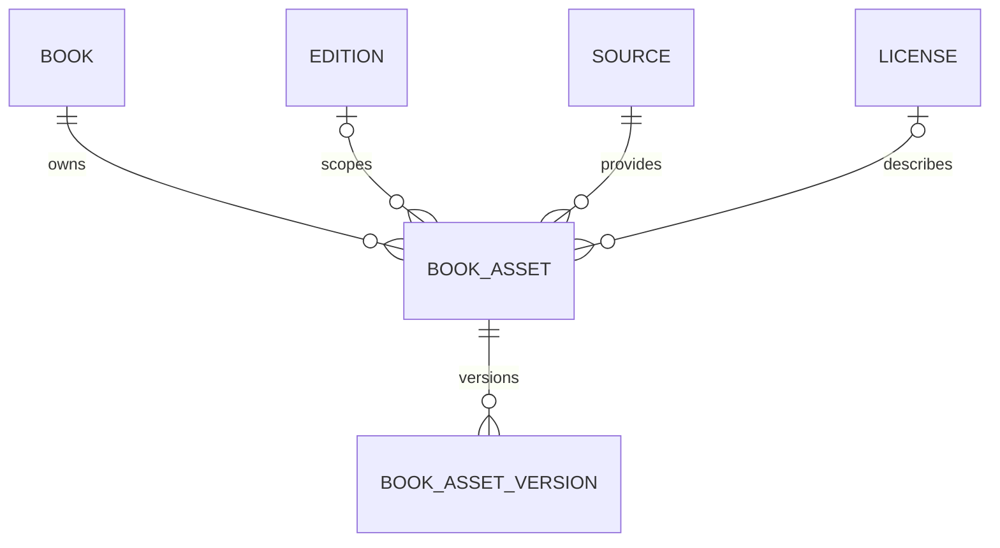

# Assets e versões — implementado em V4

Uma obra possui assets lógicos, opcionalmente associados a uma edição da mesma
obra. Cada asset possui versões físicas numeradas. PostgreSQL guarda metadados;
os bytes continuam externos. A migration não faz I/O S3; o [serviço de storage](../storage/architecture.md) agora implementa upload e distribuição.



## Contratos e campos

book_asset: UUID id; book_id obrigatório; edition_id opcional com FK composta
(edition_id, book_id); asset_type e asset_role obrigatórios e separados;
source_id obrigatório; license_id opcional; status ACTIVE/INACTIVE/DELETED;
created_at e updated_at TIMESTAMPTZ. Tipos: EPUB, PDF, TXT, HTML, COVER,
THUMBNAIL, JSON, PARQUET, AUDIO, OTHER. Papéis: SOURCE, NORMALIZED, PUBLIC,
PROCESSING, ANALYTICS, ML, COVER, DERIVED. Não há unicidade artificial por
tipo/papel: duas capas ou duas fontes podem ser legítimas.

book_asset_version: UUID id e book_asset_id obrigatório; version_number inteiro
positivo; storage_provider S3 (API, independente do fornecedor); bucket e
object_key obrigatórios e não vazios; original_filename opcional; content_type,
size_bytes e sha256 opcionais enquanto pendente, obrigatórios em AVAILABLE;
status e timestamps obrigatórios. V5 acrescenta ingestion_item_id opcional
com FK para a tentativa que produziu a versão. Tamanho não negativo, hash hexadecimal
lowercase de 64 caracteres. O hash não é unique: conteúdo igual pode aparecer
em várias versões. Não é calculado pela migration; AssetService calcula no spool e verifica HEAD
antes de marcar AVAILABLE.

UNIQUE(asset, version_number) impede versões repetidas.
UNIQUE(provider, bucket, object_key) reserva a identidade física inclusive após
DELETED. A configuração atual pressupõe um namespace S3 por instalação; múltiplas
contas/endpoints simultâneos exigirão modelar uma localização adicional.

## Estados e operações

Versões começam PENDING_UPLOAD. AVAILABLE exige metadados completos; MISSING,
FAILED e DELETED permitem registrar falhas e remoções sem perder a referência.
O CHECK valida o estado e os metadados, não impõe uma máquina de transições.
AssetService verifica existência e autorização antes da distribuição.

A numeração identifica a ordem; timestamps não escolhem a versão mais recente.
Para distribuição, filtrar asset ACTIVE e versão AVAILABLE, ordenar
version_number DESC. PUBLIC descreve finalidade, não concede acesso anônimo.

Conteúdo físico deve ser imutável por convenção de serviço: alterações produzem
nova versão e nova key. V4 não contém trigger de imutabilidade; correções SQL
administrativas são possíveis e devem ser auditadas operacionalmente. As FKs
RESTRICT evitam remoção acidental de pais com histórico. Não foi introduzido
soft delete em todas as entidades.

A licença explícita do asset é a metadata específica do arquivo; na ausência,
a edição pode oferecer contexto. UNKNOWN explícito não deve ser substituído
automaticamente por uma licença permissiva da edição. Nenhuma associação
equivale a autorização jurídica automática.

## Reconciliação e nuvem

Uma futura comparação HEAD/inventário com versões permitirá identificar
registros sem objeto (MISSING) e objetos sem registro. Objetos órfãos não são
detectáveis apenas consultando PostgreSQL; é necessário inventário S3. Reservar
uma versão pendente antes do envio permite acompanhar tentativas incompletas.
Compensação de upload e retry de DELETE estão implementados no serviço;
reconciliação periódica continua manual, conforme operations.md de storage.

Não guardar URLs absolutas: elas dependem de endpoint, expiração e futura CDN.
Construí-las a partir de bucket/key após autorização permite migrar o fornecedor.
V9 adiciona `storage_intent` para tornar o PUT e a confirmação recuperáveis sem
apagar prematuramente um objeto verificado. `operation_key` identifica a
intenção; provider/bucket/object_key identifica a localização física. O status
de disponibilidade é separado de `current_eligible`, e o asset guarda uma
referência explícita à versão corrente.

`processing_input` e `processing_output` permitem vários inputs/outputs
ordenados, preservando os campos unitários de V6 para compatibilidade. Não há
blobs, deduplicação física nem chamadas S3 dentro das migrations.

## Consulta da última versão disponível

Substitua o UUID pelo asset desejado:

```sql
SELECT v.*
FROM catalog.book_asset_version v
JOIN catalog.book_asset a ON a.id = v.book_asset_id
WHERE a.id = '00000000-0000-0000-0000-000000000001'
  AND a.status = 'ACTIVE' AND v.status = 'AVAILABLE'
ORDER BY v.version_number DESC
LIMIT 1;
```
