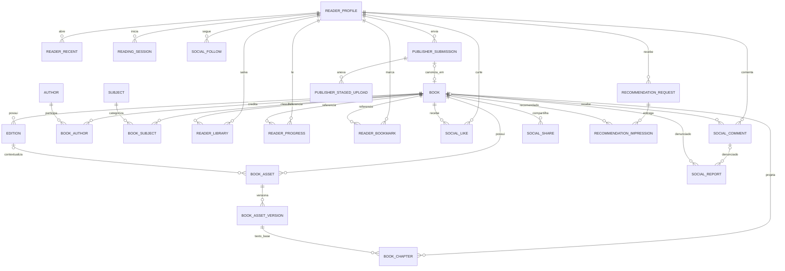
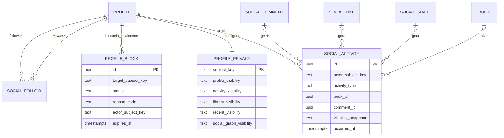
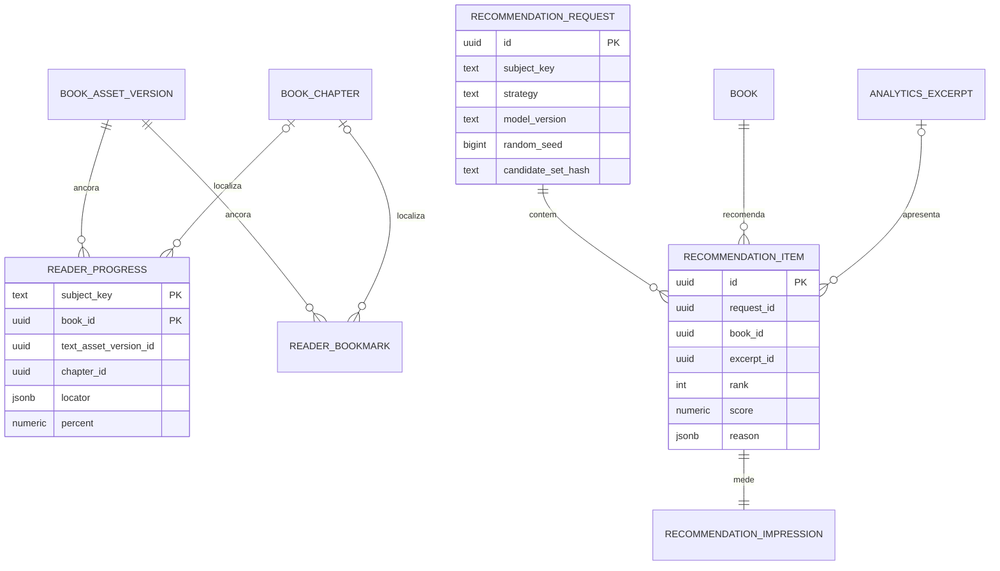
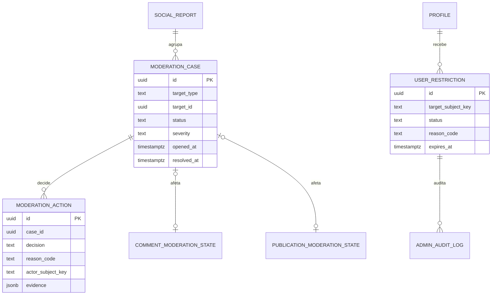
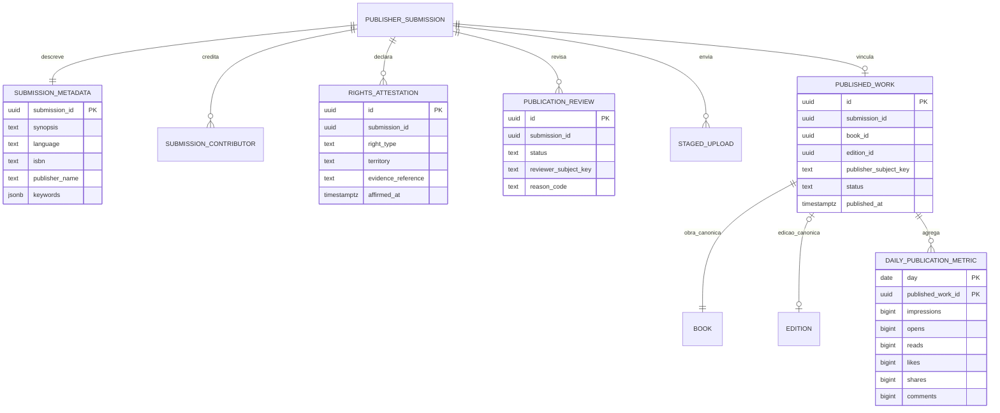

# Projeto de dados para as histórias de usuário

## Escopo e método

Este documento traduz as histórias de usuário de **“Aula 5 - Definição dos Requisitos Funcionais”** em um projeto de dados para o BookRush. A análise foi feita em 2026-10-06 contra as migrations versionadas e o PostgreSQL em execução.

O Keycloak continua sendo a autoridade de autenticação, credenciais e papéis. PostgreSQL guarda somente estado de produto, auditoria e projeções. O banco usa schemas por bounded context: um serviço não escreve tabelas de outro; referências entre contexts são IDs contratuais, validados pelo serviço dono ou por eventos/projeções. FKs ficam no contexto que detém ambos os lados.

### Chaves e convenções

- `book_id`, `edition_id`, `asset_id`, `chapter_id` e IDs de workflow são UUIDs canônicos do `catalog`.
- `subject_key` é a identidade técnica opaca derivada de `(issuer, subject)`; não é e-mail e nunca é informado pelo cliente como ator.
- Datas usam `TIMESTAMPTZ`; métricas diárias usam data UTC explicitamente.
- Decisões administrativas, direitos e publicação precisam de ator, instante, motivo e estado. Ações não sobrescrevem o histórico.
- Texto integral e binários ficam no object storage; o banco armazena metadata, versões, offsets, hashes e referências.

## Estado já entregue

| Domínio | Schema/tabelas existentes | Cobertura atual |
|---|---|---|
| Catálogo e busca | `catalog.book`, `edition`, `author`, créditos, `subject`, `book_subject`, assets, versões, direitos e capítulos | Obras, autores, assuntos, busca por título/autor/palavra-chave e conteúdo reader-ready têm base relacional. |
| Leitura | `catalog.book_chapter`; `reader_state.progress`, `bookmarks`, `recent`, `session`, `reading_day`, `library` | Abrir livro, exibir capítulos, marcar posição, salvar livros, recentes e streak possuem persistência. |
| Perfil e social | `reader_profile.profile`; `social.follows`, `likes`, `comments`, `shares`, `reports` | Perfil público simples, seguir, curtir, comentar, compartilhar e denunciar estão persistidos. |
| Recomendações | `recommendation.request`, `impression`; `behavior.events`, agregados diários | Há ledger de entrega/impressão e fatos de uso. O algoritmo atual é `heuristic-v1`, sem personalização real. |
| Administração | `admin.audit_log`, `admin.moderation`; relatórios em `social.reports` | Painel pode listar usuários/profiles, denúncias, decisões registradas e auditoria. |
| Publicador | `publisher.submission`, `staged_upload` e vínculo de ingestão/catálogo | Rascunho, upload em staging, submissão e associação posterior a livro canônico existem. |
| Analytics de trechos | `analytics.excerpt`, ranks, embeddings, features e elegibilidade | Há base para selecionar trechos; integração completa ao feed ainda é evolutiva. |

### Diagrama E/R — núcleo implementado

O diagrama omite tabelas de Flyway, auditoria de ingestão e features analíticas; elas estão detalhadas em [schema.md](schema.md).

`READER_PROFILE` é a identidade lógica `subject_key`; perfil, social e leitura pertencem, respectivamente, aos schemas `reader_profile`, `social` e `reader_state`.

## Matriz de histórias e lacunas

| Ator e história | Estado | Evidência existente | Complemento necessário no banco |
|---|---|---|---|
| Leitor — recomendações | Parcial | request/impression, eventos e agregados | Registrar estratégia/candidatos e operar ranking que use sinais por leitor. |
| Leitor — rolagem de trechos | Parcial | excerpts/ranks analytics e telemetria | Persistir entrega de trecho por superfície e política de elegibilidade. |
| Leitor — abrir e ler livro | Pronto na base | assets, versões, capítulos, progresso | Validar conteúdo/direito; opcionalmente persistir locator por capítulo/versão. |
| Leitor — busca | Pronto na base | `book`, `author`, `subject`, índices V15 e query multi-critério | Medir consultas e evoluir para índice textual multilíngue se necessário. |
| Leitor — perfil/atividades de terceiros | Parcial | perfil público e relações sociais | Política granular e feed de atividade visível. |
| Leitor — seguir, curtir, compartilhar, comentar | Parcial | follows/likes/shares/comments | Status de conteúdo e atividade pública; contadores como projeções. |
| Leitor — privacidade | Parcial | `profile.is_public` | Visibilidade por perfil, atividade, biblioteca, recentes e seguidores. |
| Leitor — marcação de página | Pronto na base | bookmarks e progress por codepoint | Guardar capítulo/versão/locator para sobreviver a nova versão textual. |
| Leitor — estou com sorte | Parcial | catálogo e ledger de recommendation | Estratégia `RANDOM`, seed/auditoria e filtros de elegibilidade. |
| Leitor — biblioteca | Pronto na base | `reader_state.library` | Estados opcionais e ordenação manual são evolução de produto. |
| Leitor — recentes | Pronto na base | `reader_state.recent` | Limite/retenção e exclusão pelo leitor são evolução. |
| Leitor — planta/streak | Parcial | sessões e `reading_day` | Definir fórmula/versionamento do estágio visual e eventos de conclusão. |
| Admin — administração e dashboards | Parcial | auditoria, moderação, reports e agregados | Projeções de KPI, filtros/paginação e retenção. |
| Admin — gerenciar usuários/bloquear | Parcial | lista de profiles/auditoria | Restrição local auditável e sincronização da suspensão real no Keycloak. |
| Admin — moderar denunciados | Parcial | reports e moderation livre | Caso tipado, estados de resolução e efeito material sobre comentário/publicação. |
| Publicador — publicar livro | Parcial | submission, upload e ingestão | Metadados, contributors, direitos, revisão e lifecycle de publicação. |
| Publicador — estatísticas | Parcial | daily_book e ligação parcial submissão–livro | Titularidade de publicação e métricas de share/comment/read por período. |

## Modelo alvo a acrescentar

As estruturas abaixo são o **desenho proposto**, não migrations aplicadas. Devem ser entregues em migrations novas, sem editar versões Flyway já aplicadas.

### Perfil, privacidade e atividade social

`profile.is_public` permanece compatível durante a migração; a fonte de decisão passa a ser uma política granular. Não se copia e-mail, senha ou papéis do Keycloak.

- Visibilidades aceitam `PUBLIC`, `FOLLOWERS`, `PRIVATE`, com `CHECK`.
- `social.activity` é append-only e guarda referências, nunca o corpo do comentário. A API reavalia bloqueio e moderação ao ler.
- `profile_block` pode ser dono do `reader_profile` ou `admin` (decisão a fixar antes da migration). A suspensão de login é um comando ao Keycloak, auditado com confirmação/falha; o banco não deve alegar que a conta foi bloqueada no IdP sem confirmação.

### Leitura, recomendação e feed de trechos

`progress` e `bookmarks` funcionam para o texto atual. Para continuidade robusta entre versões, o locator precisa referenciar versão e capítulo. A recomendação deve registrar o que entregou para permitir explicação, repetição e avaliação de vieses.

- Acrescentar `text_asset_version_id`, `chapter_id` e `locator JSONB` a progresso/bookmarks; manter `position_codepoint` durante migração.
- Evoluir `recommendation.request` com `strategy` (`PERSONALIZED`, `RANDOM`, `TRENDING`, `FEED`), `random_seed` e `candidate_set_hash`; criar `recommendation.item` e fazer `impression` referenciá-lo.
- “Estou com sorte” é request `RANDOM`: seed e filtros de direito, conteúdo reader-ready, idioma e bloqueio tornam o resultado auditável sem retirar aleatoriedade.
- `analytics.excerpt` continua dono do trecho/qualidade; `recommendation` é dono da seleção e entrega. O texto do excerpt não é duplicado.

### Administração e moderação

Hoje `social.reports` e `admin.moderation.target` são livres. Para ocultar comentário ou impedir publicação, a decisão precisa ter alvo tipado, transição válida e efeito material no serviço dono do conteúdo.

`target_type` deve limitar `COMMENT`, `BOOK`, `PUBLICATION`, `PROFILE`; a API valida que o alvo existe no contexto dono. Ocultação fica em estado próprio de comentário/publicação; conteúdo reportado não é removido fisicamente.

### Publicação e estatísticas do publicador

O catálogo é canônico para obra, edição, assets e direito de distribuição. O schema `publisher` é o workflow de quem submeteu, e não uma segunda fonte de verdade bibliográfica.

`daily_publication_metric` é projeção reconstruível de `behavior.events` e `social`, nunca fonte de verdade. `published_work` resolve a limitação de inferir titularidade apenas por `submission.catalog_book_id`, inclusive quando houver edição/republicação.

## Plano de migrations recomendado

1. `reader-profile` V3: política de privacidade; migrar `is_public` para defaults e manter a coluna até a API ser migrada.
2. `reader-state` V5: locator/versão/capítulo nullable e índices por `(subject_key, updated_at)`; preencher legados gradualmente.
3. `recommendation` V3/V4: request strategy/seed e item/impression compatíveis; backfill sintético quando necessário.
4. `social` V6/V7: estado de comentário e atividade, com índices de feed por ator e livro.
5. `admin` V4+: casos/ações/restrições tipados e ponte idempotente de sincronização com Keycloak.
6. `publisher` V6+: metadata, contributors, attestation, review, published work e métricas diárias.
7. `behavior` V7: shares/comments nas projeções, ou uma única projeção idempotente no publisher; registrar a decisão de ownership.

Cada migration deve trazer constraints/checks, índices que acompanhem a consulta real, teste de upgrade com dados existentes e teste de autorização. Não criar FK cross-schema por conveniência: publicar eventos ou validar por contrato quando os donos forem diferentes.

## Critérios de aceite por dados

- Dois leitores com sinais distintos produzem requests e itens auditáveis diferentes, com estratégia e versão do modelo registradas.
- Um trecho no feed referencia `analytics.excerpt` elegível e sua entrega é medida sem duplicar texto.
- Perfil privado não expõe atividade, biblioteca, recentes nem grafo social fora da política, inclusive por endpoints administrativos sem papel.
- Bookmark retorna à mesma versão/capítulo; mudança de texto tem fallback explícito, nunca reposicionamento silencioso arbitrário.
- Denúncia gera caso e ações; decisão de ocultar altera a consulta pública, preservando evidência e auditoria.
- Bloqueio é idempotente, auditado e tem estado de confirmação do Keycloak; o banco não armazena credenciais.
- Publicação aprovada possui metadata, contribuição, direito declarado, vínculo canônico e métricas diárias, sem acesso a dados de outros publicadores.

## Referências internas

- [Modelo e regras do catálogo](schema.md)
- [Estado do leitor](reader-state-service.md)
- [Dados sociais](social-service.md)
- [Eventos e agregados comportamentais](behavior-service.md)
- [ADR de publicação Readium](../adr/ADR-011-readium-reader-ready-publication.md)
- [Projeto de storage](../storage/data-model.md)
