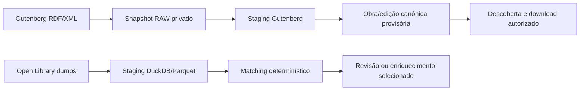

# ADR-002 — Gutenberg primeiro e enriquecimento local Open Library

## Contexto

O primeiro fluxo precisa ser reproduzível, auditável e executável sem depender
de consultas HTTP por livro. O Project Gutenberg oferece catálogos oficiais
machine-readable; o Open Library oferece dumps grandes que precisam ser
processados localmente. O serviço não deve raspar páginas humanas nem confundir
uma publicação digital com os dados de uma edição impressa.

## Decisão

O fluxo inicial será:

Gutenberg é a fonte autorizada para descobrir IDs, títulos, criadores, roles,
idiomas, subjects, tipo, direitos, release e URLs de formatos. O parser usa
RDF/XML oficial com XXE e entidades externas desativadas. Filtros e motivos de
exclusão são persistidos. Quando um formato não tem URL autorizada, o item é
registrado como indisponível; filename não é adivinhado.

Open Library é usado como enriquecimento local e matching. O parser preserva
authors, works, editions, redirects, deletes, tipos, revisões e ausências dos
dumps. A ausência em um snapshot não é uma deleção. Não há fallback de API por
livro nem varredura remota para completar candidatos.

O modo padrão é `DISTRIBUTABLE_FIRST`: somente dados e arquivos com decisão de
direitos compatível avançam para distribuição. Isso é uma política operacional,
não uma garantia jurídica. `CATALOG_FULL` só poderá ser exposto quando houver
implementação real para todos os estados previstos.

## Matching

O matching separa pessoa, obra e edição. Primeiro usa identificadores explícitos;
depois bloqueia por título, contribuidores e idioma, limitando candidatos e
ordenando empates de modo estável. A pontuação definida na especificação é
`.55 título + .35 contribuidor + .10 idioma`, sem reponderar campos ausentes.
ISBN exato não prova que um EPUB Gutenberg seja a mesma edição impressa.
Homônimos, antologias, traduções, conflitos de identificador e evidência fraca
vão para revisão. Uma obra Gutenberg provisória pode ser ligada depois, mas duas
obras canônicas distintas geram proposta de merge e não movem assets ou créditos
automaticamente.

## Consequências

O primeiro vertical será menor, mas pode ser reproduzido a partir de snapshots
sem acesso à internet. O enriquecimento depende de staging e matching
determinístico; indisponibilidade do dump OL pausa apenas essa etapa, enquanto
downloads Gutenberg já autorizados podem prosseguir. Toda decisão precisa manter
snapshot, regra, evidência e provenance suficientes para auditoria.

## Evidência exigida

Fixtures offline devem cobrir RDF com campos ausentes, roles, filtros e XXE;
dumps TSV/JSON com tabs, redirects, deletes e revisões; e matching ambíguo. Os
testes devem demonstrar repetição sem entidades duplicadas e não podem declarar
uso de fontes reais se apenas fixtures foram executadas.
