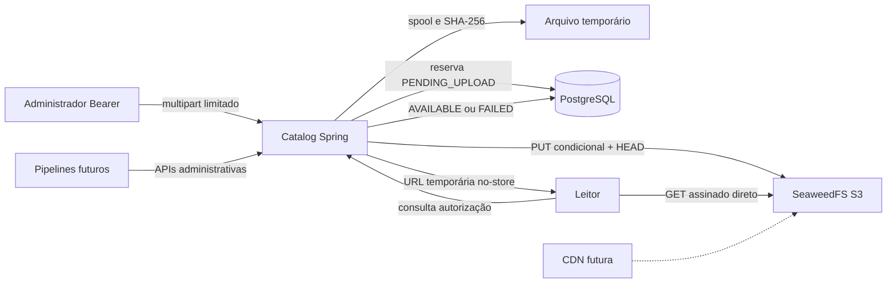

# Arquitetura implementada

O catalog-service é dono das tabelas [bibliográficas](../database/schema.md).
ObjectStorage define PUT condicional, HEAD, GET interno por stream, DELETE e
GET assinado. S3ObjectStorage implementa AWS SDK Java v2; o domínio não conhece
SeaweedFS. Não existe outro schema/tabela de assets concorrente.

Binários não entram em PostgreSQL, evitando WAL/backups/transporte relacional de
livros. URLs não identificam objetos; endpoint/TTL são decisões de distribuição.
Download não retransmite bytes pelo backend. CDN não foi implantada.

## Upload e consistência

1. Validar nome e copiar stream em spool temporário limitado, calculando SHA-256.
2. Detectar conteúdo/MIME; declaração incompatível é rejeitada.
3. Transação curta reserva asset INACTIVE e versão PENDING_UPLOAD, incluindo key.
4. PUT com If-None-Match '*' e checksum SHA-256; HEAD confere tamanho/MIME/hash.
5. Nova transação marca AVAILABLE. Aprovação pública é operação separada.
6. Qualquer falha após reserva tenta compensar com DELETE e marca FAILED.
   Em conflito de key, não remove o objeto preexistente.
7. Se compensação ou banco falhar, logs com IDs e linha pendente/falha permitem
   reconciliar. Não há XA; queda de processo pode deixar pendência. O spool é
   removido ao concluir a chamada (arquivos de processo interrompido exigem
   limpeza do diretório temporário após confirmar que não há uploads ativos).

Falha de commit é capturada fora do TransactionTemplate, não apenas no save.
Versões de derivados recebem número sob lock do asset e retiram aprovação;
SOURCE não aceita novas versões. Aprovação rejeita uploads ainda pendentes.
Delete marca asset DELETED antes de remover versões físicas; falha parcial
mantém keys, e repetir DELETE conclui. URLs emitidas antes da retirada podem
continuar válidas até expirar, se o objeto ainda existir.

## Segurança e limites

Token Bearer administrativo único de pelo menos 32 caracteres, via ambiente.
Sem Basic, cookie ou sessão; CSRF não se aplica a credenciais enviadas apenas
explicitamente no header. Uma identidade administrativa inicial; futuro OIDC
deve substituir isso se houver vários operadores. Não habilitar logs de headers.

API administrativa exige ASSET_ADMIN. Distribuição pública só admite book ACTIVE,
asset ACTIVE e role PUBLIC, versão AVAILABLE e licença com redistribution_allowed
explicitamente true. Licença do asset prevalece; UNKNOWN não herda permissões da
edição. Decisão jurídica não é automatizada por esse booleano: aprovação é
responsabilidade administrativa. SOURCE/PROCESSING/ML não têm rota pública.

Tipos aceitos: TXT UTF-8 sem NUL, JSON sintaticamente válido, HTML UTF-8, EPUB
ZIP com mimetype e container.xml, PDF por assinatura, PNG/JPEG/WebP por assinatura,
Parquet por cabeçalho/rodapé. São verificações de formato, não antivírus ou
sanitização completa. AUDIO/OTHER são rejeitados até existir detector. MIME não
depende da extensão. Upload limitado a 100 MiB e spool, nunca buffer integral.
Download assinado usa attachment e não há PUT assinado: falta protocolo de
finalização/integridade/aprovação confiável para upload direto.

Todos os buckets são privados no ambiente criado. Credencial local do gateway
é administrativa; não publicar filer/master/volumes. S3 só é publicado no loopback.
Links externos exigem endpoint público configurado antes da assinatura; não
reescrever host/porta/path depois. Navegação/download funciona sem CORS;
fetch/XHR cross-origin requer política CORS explícita ainda não instalada.
