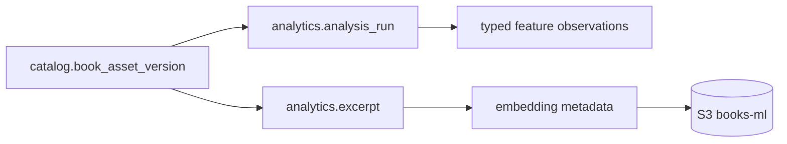

# Arquitetura

O PostgreSQL armazena metadados, hashes, offsets e resultados pequenos. Vetores
ou artefatos grandes ficam no object storage e são identificados por bucket/key.
A entrada é sempre um `book_asset_version`; não existe analytics de uma obra
abstrata sem conteúdo físico.

Quando `ANALYTICS_WORKER_ENABLED=true`, o worker reclama itens persistentes em
`analysis_job_item`, lê o objeto S3-compatible fora de uma transação, verifica
tamanho/hash/UTF-8/NFC/LF e grava excerpts e features determinísticas. A
reexecução reutiliza o `analysis_run` concluído para a mesma versão e gerador;
falhas ficam no item para retomada explícita. Embedding, emoção e LLM não são
baixados nem executados implicitamente.

O catálogo expõe `GET /api/internal/v1/catalog/processings/text-versions/{id}`
para leitura de hash, object key e capítulos. O endpoint é somente leitura e
não permite que analytics altere o schema `catalog`.

Embeddings não são colunas JSONB: os metadados ficam em `embedding_model`,
`excerpt_embedding` e `document_embedding`; bytes e índices grandes ficam no
bucket `books-ml`, conforme ADR-005.

`EmbeddingIdentity` deriva SHA-256 do texto UTF-8 e exige modelo, versão e
dimensão explícitos. Isso fornece cache/idempotência sem baixar modelo durante o
startup; o registry inicial contém apenas o modelo disabled.

A inferência é batch por `EmbeddingProvider`; o adaptador inicial fica disabled
porque nenhum modelo foi versionado no repositório. Ele não inventa vetores nem
faz download em runtime. Um provider local futuro deve validar checksum,
dimensão e preencher `excerpt_embedding`/`document_embedding` por input hash.

Protótipos semânticos são objetos versionados (`code`, `version`, dimensão) e
suas similaridades usam cosseno com dimensão validada. O vetor do protótipo deve
ser carregado de artefato versionado, nunca de strings hard-coded dispersas.

`PrototypeClassifier` produz topic candidates offline por protótipo mais próximo;
o score é observação de modelo e carrega a versão do protótipo. Não cria uma
ontologia definitiva nem exige serviço de vetor para fixtures pequenas.

## Jobs administrativos

`POST /api/admin/v1/analytics/jobs` aceita `Idempotency-Key` igual a
`operationKey`. O request é armazenado por SHA-256; replay idêntico retorna o
job existente e um corpo diferente retorna `409 IDEMPOTENCY_CONFLICT`. Criações
novas retornam `202` e `Location`. Os itens podem ser consultados em
`/items`, cancelados cooperativamente e retomados em `/resume` sem apagar
histórico de tentativas. Em produção, habilite `ANALYTICS_SECURITY_ENABLED` e
configure o issuer OAuth2; as rotas administrativas/internas exigem o scope
`bookrush.analytics`.

O Flyway do analytics referencia FKs em `catalog.book_asset_version` e
`catalog.book_chapter`; o catálogo canônico deve estar migrado antes do
analytics. O Compose expressa essa ordem por dependência de serviço. Uma
inicialização isolada em PostgreSQL sem o schema `catalog` falha de propósito,
em vez de criar tabelas duplicadas.
