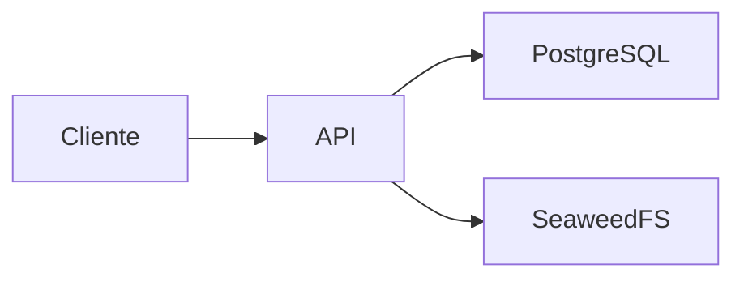

# Arquitetura

Adquire RDF e EPUB do Gutenberg, persiste snapshots RAW e coordena jobs, normalização TXT e chapters.json.

Java 21, Spring Boot 3.3.5, Maven, PostgreSQL e API S3. Ownership: jobs e aquisição; utiliza também tabelas operacionais no schema catalog.

