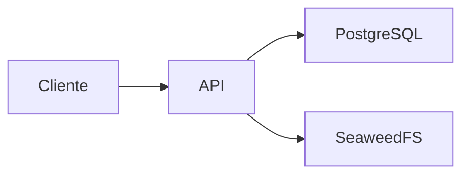

# Arquitetura

Mantém obras, edições, autores, identificadores e assets; autoriza distribuição por URL S3 temporária.

Java 21, Spring Boot 3.3.5, Maven, PostgreSQL e API S3. Ownership: entidades canônicas e migrations Flyway V1–V13 no schema catalog.

